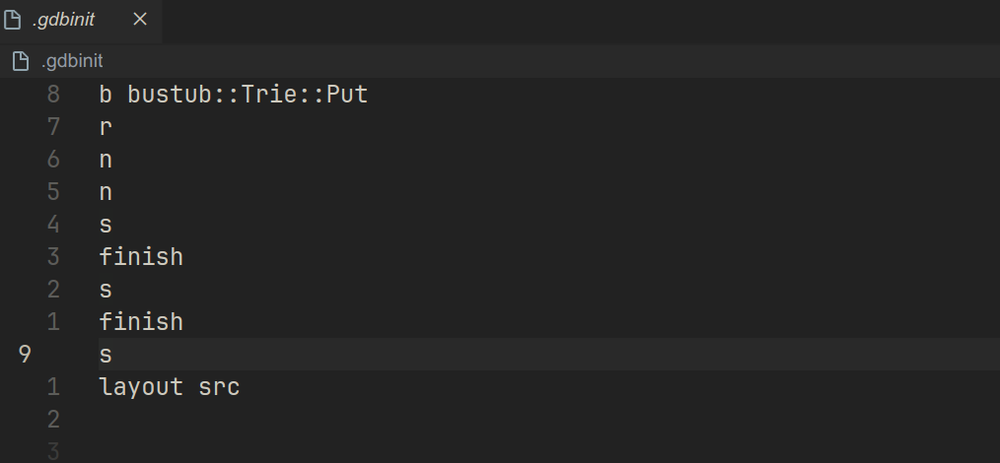

## 配置环境

### 宿主机环境
```
OS: Manjaro Linux x86_64
██████████████████  ████████   Host: HLYL-WXX9 M1010
████████            ████████   Kernel: 6.1.44-1-MANJARO
████████  ████████  ████████   Uptime: 2 hours, 22 mins
████████  ████████  ████████   Packages: 1934 (pacman)
████████  ████████  ████████   Shell: zsh 5.9
████████  ████████  ████████   Resolution: 1920x1080
████████  ████████  ████████   DE: GNOME 44.3
████████  ████████  ████████   WM: Mutter
████████  ████████  ████████   WM Theme: Adwaita
████████  ████████  ████████   Theme: adw-gtk3-dark [GTK2/3]
████████  ████████  ████████   Icons: Papirus-Maia [GTK2/3]
                               Terminal: alacritty
                               Terminal Font: 'JetBrainsMonoNerdFont'
                               CPU: AMD Ryzen 5 4600H with Radeon Graphics (12) @ 3.000GHz
                               GPU: AMD ATI 03:00.0 Renoir
                               Memory: 3822MiB / 15360MiB
```

### 使用 docker 搭建环境

实验只给出了 `Ubuntu` 的环境配置教程，与 `manjaro` 不兼容，遂使用 `docker` 搭建。

- 拉取仓库  `git clone https://github.com/cmu-db/bustub.git` 

参考仓库中的 `README` 配置 docker.

> 以下内容 来自 仓库中的 README.md

First, make sure that you have docker installed:
```
$ sudo apt update
$ sudo apt install docker
```
or 
```
$ sudo pacman -Syu
$ sudo pacman -S docker
```
From the repository directory, run these commands to create a Docker image and container:
> 在仓库文件夹下，执行下面的命令创建一个镜像和容器

```
$ docker build . -t bustub # 在当前文件夹下寻找 Dockerfile, 创建名为 bustub 的镜像
$ docker create -t -i --name bustub -v $(pwd):/bustub bustub bash # 根据镜像 bustub, 创建一个 bustub 的容器，并把当前文件夹映射到 容器的 /bustub 目录, 创建镜像后执行 bash 命令 
```

This will create a Docker image and container. To run it, type:

```
$ docker start -a -i bustub
```

to open a shell within the box. You can find Bustub's code mounted at `/bustub` and run the commands mentioned above like normal.

> ps 容器是镜像的实例， 一个镜像可以有多个实例 

### 构建项目

进入 docker 后，执行下面的命令，构建整个项目

```bash
$ cd /bustub
$ mkdir build
$ cd build
$ cmake ..
$ make # or  make -j`nproc` 用多线程进行构建，速度更快 
```

为了能够让编译器在编译过程中加入调试信息，我们需要将 cmake 的 构建模式设置为 Debug

```bash
$ cmake -DCMAKE_BUILD_TYPE=Debug ..
$ make -j`nproc`
```

### 项目文件结构

推荐使用 vscode + remote 插件 或者 使用 CLion

[教程](https://blog.csdn.net/weixin_40641725/article/details/105512106) 

- `build` 文件夹储存编译后的结果
- `src` 文件夹最为重要，储存项目核心代码
    - `src/include` 存放自定义头文件
    - `src/primer` 存放的是 project0 cpp 文件 
- `test` 文件夹存放测试文件
    - `test/primer` 存放的是 project0 的测试文件

### Vscode 插件

> 来自 project0 文档

If you are using VSCode, we recommend you to install CMake Tools, C/C++ Extension Pack and clangd.

CMake Tools 插件需要一些配置，请参考 [教程](https://code.visualstudio.com/docs/cpp/cmake-linux) 
如果使用 Docker，debug 功能好像没法使用，需要另外配置

**debug** 

创建 .vscode/launch.json

```json
{
    // Use IntelliSense to learn about possible attributes.
    // Hover to view descriptions of existing attributes.
    // For more information, visit: https://go.microsoft.com/fwlink/?linkid=830387
    "version": "0.2.0",
    "configurations": [

        {
            "name": "(gdb) Launch",
            "type": "cppdbg",
            "request": "launch",
            "program": "${workspaceFolder}/build/test/trie_test",
            "args": [],
            "stopAtEntry": false,
            "cwd": "${fileDirname}",
            "environment": [],
            "externalConsole": false,
            "MIMode": "gdb",
            "setupCommands": [
                {
                    "description": "Enable pretty-printing for gdb",
                    "text": "-enable-pretty-printing",
                    "ignoreFailures": true
                },
                {
                    "description": "Set Disassembly Flavor to Intel",
                    "text": "-gdb-set disassembly-flavor intel",
                    "ignoreFailures": true
                }
            ]
        }

    ]
}
```

注意，debug 需要将cmake的模式设置为 `Debug`,  且记得替换上述配置中 `program` 的可执行文件地址 

当然， 使用 gdb 也是极好的。

> gdb 启动时，会自动读取 .gdbinit 文件的内容，你可以将 gdb 命令保存在这个文件中，这样就不需要每一次调试都重复输入。

比如



### 代码规范

```bash
make format # 会自动更正
make check-lint # 测试代码规范
make check-clang-tidy-p0 
```

## spec
### task1
首先

在这个项目中，你将实现一个 有着 copy-on-write 特性的字典树 trie。trie 可以高效的根据 key 来查询 value. 为了方便阐述，我们假设 trie 的 键 是不定长的, 虽然实际上 键可以是任意一种类型。

首先根据README 看 如何构建环境，之后熟悉项目结构，看懂 makefile. 再尝试进行写代码和调试。
首先，看一下测试代码是如何初始化 Trie 这个 数据结构的，整理出函数调用关系。

#### 初始化


`trie_test.cpp` 中第一个测试语句是 `auto trie = Trie()` , 说明调用了 Trie 的默认构造器。
我们来看看 `Trie` 默认构造器的实现

`Trie() = default` 

默认构造器使用了编译器为其生成的默认构造器，这个 默认构造器 会尝试调用所有成员函数的默认构造器进行初始化。
`Trie` 的成员函数只有一个， `std::shared_ptr<const TrieNode> root_{nullptr};` 。`root` 指定了使用 nullptr 作为参数进行初始化，也就是说 root_ 指向 nullptr。

根据 `shared_ptr` 的特性，它会使用接受的参数作为 指定类型 (TrieNode) 的构造函数的参数 `TrieNode()` 创造一个对象, 然后对这个对象进行一些包装。 

所以，我们来看看 `TrieNode` 的构造函数 `TrieNode() = default` , 这同样是编译器为其生成的默认构造器，TrieNode 有两个成员 `map` 和 `is_value_node_`。map 被初始化为空，is_value_node_ 被初始化为 false

#### Get && Put

完成这些之后，我们就可以开始写 Trie 了。
首先要明确 trie 的 结构

Q: 逆天的难题，map 值的类型是 const TrieNode, 都是常量了我还怎么创建新节点啊。

A: 考虑使用 Clone 函数，创建新节点。


Q: Trie 的构造器只能接受 `shared_ptr<TrieNode>` 作为构造参数，但是终端节点的类型是 `shared_ptr<TrieNodeWithValue>`。好像没有办法做 向上转型。

A: 是可以向上转型的，直接传递 `shared_ptr<TrieNodeWithValue>` 作为 Trie 的构造参数即可，不需要 手动转换。

Q: Clone 方法将成员变量再次包装成 unique_ptr, 这不会造成 double free 吗。

A: 这是没有关系的，成员变量类型是 map。cpp 内部会将数据复制一份，然后让 unique_ptr 指向 复制后的数据

Q: 目前好像只能插入第一个节点，后续更改失踪了。

A: 由于是 const 类型， 所以再怎么样也是改不了节点的内容的

参考 [知乎](https://zhuanlan.zhihu.com/p/613920859) , 重写Put
需要实现写时复制的字典树，所以不是按照abc的顺序，而是cba向上递归

本题的核心就是如何在 不更改原始 trie 结构的前提下，通过递归的方式，构建一个新的trie (同时还要复用原始trie的节点)

### task2 

实现一个 concurrent trie

当你有了一个可以单线程可用的写时复制 trie, 再尝试实现一个 多线程下可用的 trie。在这个任务中，你需要修改 `trie.h` 和 `trie.cpp` 文件。这个数据结构也支持三种操作

- `get` 
- `put` 
- `delete` 

对于原始的 Trie, 每当我们想要修改 trie 的内容，我们就需要创建一个新的
根节点来访问修改后的内容。但是对于 concurrent trie 的 `put` 和 `get` 方法来说，他们没有返回值，这就需要你使用 并发特性 来同步读写操作，以避免
在修改过程中造成数据丢失。

你的 concurrent trie 应该能支持多个读者 和 一个写者。也就是说，当写者在修改 trie 的时候，读者可以通过老根节点来访问数据。当有读者正在读取数据时，
写者不需要等待读者读取完成。

同时，如果你获取了 trie 中任何一个节点的值 的引用，那么不论之后对trie
做了什么操作，我们都应该能够通过引用获取到这个值。`get` 方法只返回一个指针，如果这个 trieNode 被删除后，这个指针就会变为 悬垂指针， 为此，我们将返回值用 `ValueGuard` 类包装，`valueGuard` 不仅保存了 指针和对应的值，还保存了这个 TrieNode 所对应的根节点。

为了做到这点，我们已经为你在 `TrieStore::Get` 方法中写好了 伪代码，请严格
按照 说明进行 编写。
