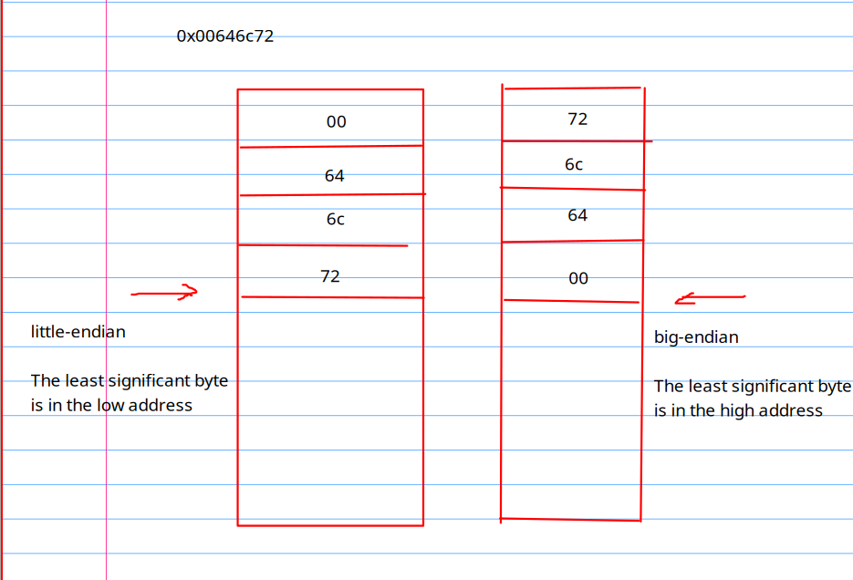
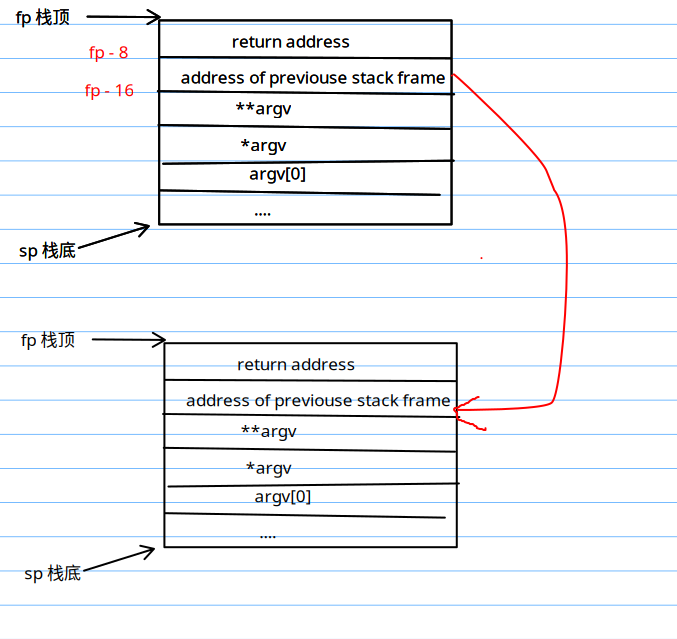

## Trap


Q: Which registers contain arguments to functions? For example, which register holds 13 in main's call to printf?

- regisetr a2

Q: Where is the call to function f in the assembly code for main? Where is the call to g? (Hint: the compiler may inline functions.)

- 编译器优化了对与 f 和 g 的函数调用

26:	45b1                	li	a1,12


Q: At what address is the function printf located?

0x616

Q: What value is in the register ra just after the jalr to printf in main?

0x616

Q: Run the following code.

	unsigned int i = 0x00646c72;
	printf("H%x Wo%s", 57616, &i);
      
What is the output? Here's an ASCII table that maps bytes to characters.
The output depends on that fact that the RISC-V is little-endian. If the RISC-V were instead big-endian what would you set i to in order to yield the same output? Would you need to change 57616 to a different value?

HE110 World;
0x726c64;
57616 不需要改变



Q: In the following code, what is going to be printed after 'y='? (note: the answer is not a specific value.) Why does this happen?

	printf("x=%d y=%d", 3);

A: read data that locates outside the stackframe

Q: riscv 不是定长编址，一条指令64位吗，怎么这里指令的位置之间相差2

64位指的是 可寻址范围是 2^64, 和指令长度没有关系。
xv6 采用的指令集中的指令是非定长的。(16 bit / 32 bit)

Q: auipc 指令是干啥的

auipc rd imm => rd = PC + imm << 12 

>

imm 剩下的12位在 jalr 里

auipc指令将立即数左移12位加到PC上。这样，可以将auipc中的20位立即数与jalr中的12位立即数组合，将执行流程转移到任何32位pc相对地址。而auipc加上普通加载或存储指令中的12位立即数偏移量，可以使得程序访问任何32位PC相对地址的数据

Q: 如果储存不下，计算地址的时候不会溢出吗？

运算的时候在ALU中进行的，与机器字长有关， 和指令字长无关。

机器字长
储存字长
指令字长
寻址空间


Q: 地址不太对的上哦。 
对的上
30: ra = PC(0x30) + 0 = 0x30
34: pc = ra + 1510 = 1510 + 3 * 16 = 1558 = 0x616


### backtrace

Q: 这个 stackframe 的地址为啥这么小
A: 打印出来的是物理地址

Q: 栈是存在虚拟内存的那一个位置？
A: 

完成本实验的关键点，在于理解栈帧 (stack frame) 这个模型



还有指针的妙用 

r_fp 这个函数 返回的是当前函数的 fp 地址。由于 `xv` 
是 64 的机器，我们用 `uint64` 来保存当前函数的 `fp` 。

又因为 ra 储存在 栈顶，且 `xv6` 是 `little endian` 存储，所以我们知道储存 `ra` 低字节的数据存放在 低地址，也就是 `fp - 8` 这个位置。

拿到 这个地址后，我们要怎么获取这个地址所保存的值呢？
可以将这个地址转换为指针的类型，然后通过 `*fp` 的方式来获取对应的值。

其实看到这里，我们就知道，指针不过是 C 语言提供给我们的一个语法糖。 `*p` 的本质相当于

```c
void copy(void* a, void* b, int len) 
{
    char* a1 = (char *)a;
    char* b1 = (char *)b;
    
    while (len-- > 0) {*a1++ = *b1++;}
}

```


```c

void
backtrace(void)
{
  uint64 fp = r_fp();
  uint64 up = PGROUNDUP(fp);
  uint64 down = PGROUNDDOWN(fp);
  
  while (fp <= up && fp >= down) {
    uint64* ra = (uint64* )(fp - 8);
    uint64* pre_fp = (uint64* )(fp - 16);
    printf("%p\n", *ra);
    fp = *pre_fp;
  }
}
```

做完这个实验我也终于理解了

> The allocator sometimes treats addresses as integers in order to perform arithmetic on them
> (e.g., traversing all pages in freerange), and sometimes uses addresses as pointers to read and
> write memory (e.g., manipulating the run structure stored in each page); <br>
> this dual use of addresses
> is the main reason that the allocator code is full of C type casts. <br> The other reason is that freeing
> and allocation inherently change the type of the memory


## Alarm

题意: 在某一个程序调用了 `sigalarm` 后， 每间隔 `n` 个时钟周期，就会进入进入中断，调用 `handler` 函数。
想要取消周期性中断，程序可以调用 `sigalarm(0, 0)` 

test0  
难点：
1. 怎样获取时间
2. 没有找到 kernel 获取 timer interrupt 的代码

好像不需要手动获取时间, 硬件帮我们做到了
> Every tick, the hardware clock forces an interrupt'
> 直接用 ticks 这个全局变量

可以在这个条件下，处理 tick

>   if(which_dev == 2) ...

test1  
难点:
1. 储存什么寄存器才能正常回复状态


`int* p = 1;`

    fill in the content of p to 1.

`*p = 1`

    find the address of p.
    get its value (another addrss),
    according to the address 
    find the value 
