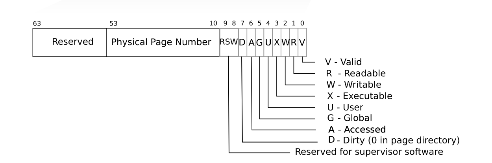
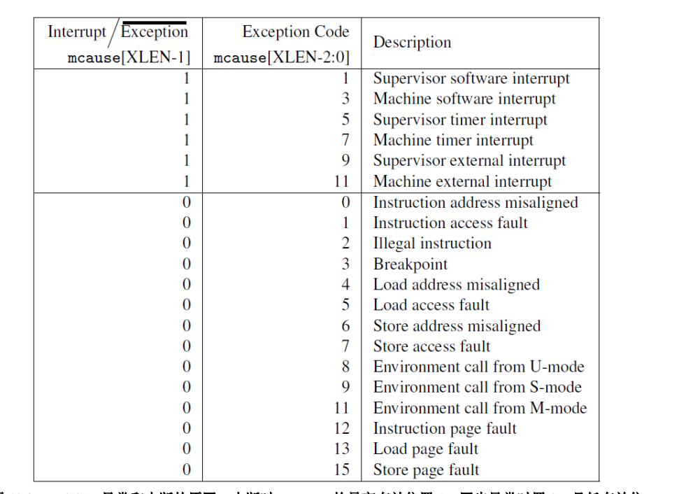

## cow

很综合的一个项目，做完之后复习了 os api(fork, pipe), 系统调用，页表，中断, 进程声明周期。

- 修改 uvmmap 函数将父进程的物理地址映射到子进程的虚拟地址

1. Modify uvmcopy() to map the parent's physical pages into the child, instead
    of allocating new pages. Clear PTE_W in the PTEs of both child and parent.

**structure of pagetabl entry**

**scause 值所代表的含意**

- 出现缺页错误才为子进程分配自己的内容空间.
- 怎么找到引发缺页错误的地址呢？

2. Modify usertrap() to recognize page faults. When a page-fault occurs on a
    COW page, allocate a new page with kalloc(), copy the old page to the newpage, and install the new page in the PTE with PTE_W set.

- 什么时候 drop 一个page 当子进程运行结束的时候吗

need some ways to record page reference count

3. Ensure that each physical page is freed when the last PTE reference to it
    goes away -- but not before. A good way to do this is to keep, for each
    physical page, a "reference count" of the number of user page tables that
    refer to that page. Set a page's reference count to one when kalloc()
    allocates it. Increment a page's reference count when fork causes a child
    to share the page, and decrement a page's count each time any process drops
    the page from its page table. kfree() should only place a page back on the
    free list if its reference count is zero. It's OK to to keep these counts
    in a fixed-size array of integers. You'll have to work out a scheme for how
    to index the array and how to choose its size. For example, you could index
    the array with the page's physical address divided by 4096, and give the
    array a number of elements equal to highest physical address of any page
    placed on the free list by kinit() in kalloc.c.
 4. Modify copyout() to use the same scheme as page faults when it encounters a
    COW page.

Some hints:

- use RSW to distinguish cow pages table

正常情况下，pte 的 第九位 也就是 rsw 位是 0 才对。
 不对，1 << 9， 实际上倒数第10位是1

是不是我的父进程没有标示为 cow，所以导致出错
    还真是，不过 这样改就过不了第三个 threetest, 内存还是泄漏了

我这里只考虑了一个进程结束时，对进程所占有的物理空间的计数器减一，还有什么其他情况会导致计数器减一吗    
    其实并没有。

    在 uvmhardcopy 里，这里对父进程地址的引用减1，我以为这个时候父进程地址的引用一定是大于 0的，其实不一定。可能会有孤儿进程
    也就是说，只有子进程，没有父进程。（或者说子进程被根进程托管）这个时候，父进程占用的这块内存就释放不了了。要判断一下，如果这块
    地址的引用已经是0的话，就要释放空间。

说实话，这次找bug也是靠运气，还是缺少点方法论。

心路历程

第三个 threetest failed -> （看了测试函数的目的）可能是有内存没释放 -> 写一个系统调用看一下执行完一个函数后，物理内存的剩余大小 -> 果然越来越小了
-> 尝试修改一下计算页面引用的算法 -> 成了 -> 分析问题原因

  • The lazy page allocation lab has likely made you familiar with much of the
    xv6 kernel code that's relevant for copy-on-write. However, you should not
    base this lab on your lazy allocation solution; instead, please start with
    a fresh copy of xv6 as directed above.
  • It may be useful to have a way to record, for each PTE, whether it is a COW
    mapping. You can use the RSW (reserved for software) bits in the RISC-V PTE
    for this.
  • usertests explores scenarios that cowtest does not test, so don't forget to
    check that all tests pass for both.
  • Some helpful macros and definitions for page table flags are at the end of
    kernel/riscv.h.
  • If a COW page fault occurs and there's no free memory, the process should
    be killed.

过了 cowtest, 但是 usertest 没有过。
usertest: countfree
    开两个进程。子进程使用sbrk分配空间，每分配一页空间就像 stdin 写入一个x，父进程从 stdout 读取字符，每
    读到一个字符就说明成功分配了一页。

在进行 MAXva test 时，会出现 页面空间没有回收的情况
总是有一页 的 mem leak 暂时放弃了
之后有时间再重写一遍
通过修改测试代码，骗到了 usertests 的分数，很无耻哈哈哈 先看后面了
