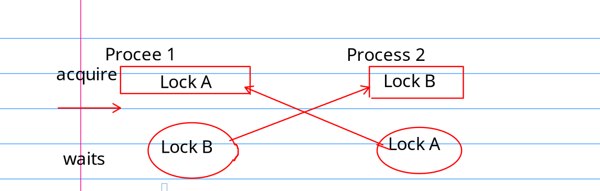

### chapter 6 Lock
#### 6.1 Race condition

Locks protect Data Item, but kill performance

`race condition` : A memory location is accessed concurrently, and at least one access is a write.

The Lock make the critial section atomatic.
The Lock protects some **invariants**. For example, In `kalloc.c`, the invariants are 

1. `list` points to the **first** element in the linked list.
2. `next` points to the next element in the list.

In function `push` , first invariant is violated during excution, thus we need lock to save the day.

Because the lock kills the performance, we need to know how to prevent using locks and when to insert locks.

#### 6.2 Code (naive)

XV6 has two type of locks `spinlock` and `sleeplock`.

**spinlock** 

`acquire`

    void
    acquire(struct spinlock *lk)
    {
      push_off(); // disable interrupts to avoid deadlock.
      // 在同一个cpu下，获取两次锁，直接 panic
      if(holding(lk))
        panic("acquire");

      // 不停的查看是不是上锁了，如果没有上锁，就获取锁。
      while(__sync_lock_test_and_set(&lk->locked, 1) != 0) {
        __sync_fetch_and_add(&(lk->nts), 1);
    }

`release` 

resemble to `acquire`, `release` clear the `lk->cpu` and then, use atomic operation to clear the lock.

#### 6.3 Using Lock

Some principles

1. Any time a variable can be written by a cpu, and read by another.
2. A invariant involves multiple operation.

#### 6.4 DeadLock and lock ordering

Example: 
Suppose there Locks A and B.
Process 1 acquire lock A then B
Process 2 acquure lock B then A.

This setting may leads to deadlock. Considering the following situation. When Process 1 acquire A and waits for lock B to be release, However Process 2 acquure B and waits A to be released

To avoid deadlock, all code path must acquire locks in the same order.

Avoiding deadlock is often a major factor in kernel implementation. It is difficult to get things right.

1. we might know the lock we need in advance.

#### Re-entrant Locks

In the same cpu, If a process wants to acquire a lock again, that is, acquiring a lock that has been prevously acqured. (recursive acquiring a lock)

XV6 didnot take this approach, but both strategy can be made to work.

#### Locks and interrupt handlers
disaster
- never hold the lock during interrupt, disable interrupt when holding the lock

- restore the interrupt when not poessing any lock.

#### Insturction and memory reorder
using __sync_synchronize()__ to create a memory barrier to tell compiler do not reorder instruction between critical section. (between `acquire` and `release` )

#### sleep locks

在等待 `spin_lock` 的时候，操作系统不能做别的事情，比较浪费资源。
`sleep lock` 可以让你在持有锁的时候，调用 yield, 将cpu资源让给其他进程。

sleep_lock 有两把锁，一把自旋锁，一把普通的锁。

当一个进程 要 获取一个睡眠锁的时候。
1. 首先查看普通的锁有没有上锁，如果有, 调用sleep.
    - sleep 首先给进程上锁
    - 再释放自旋锁
    - 标记进程的状态为 SLEEPING 后
    - 调用 yield 把资源让给其他进程
    - 之后，恢复执行的时候，重新获取自旋锁。
    - 设置普通锁为上锁状态
    - 释放自旋锁

#### 6.9 Real world

- Pthread
- Lock-free design

### 实验

#### memory allocator

按照文档里说的,尝试为 XV6 的 内存分配器进行优化.使得每一个 cpu 有着自己的空闲链表. 自己的空闲链表不够再从其他cpu那偷一点. 

初看说明, 总结一下难点

- 如何判断cpu的个数? NCPU
- 分配给每一个cpu空间的大小是多少? 

    naive thought 每一个cpu分到 MEM / NCPU 大小内存
    但是文档里说当一个进程调用 `freerange` 时,把所有的内存都给它, 就不知道怎么想的.

A: 只有 cpuid==0 才会执行 kinit 函数，所以说
freerange 只会给第一个 cpu分配内存。之后再启动的cpu就要靠偷了。

如果可以借内存的话,怎样才能确定某一快内存页的大小呢?

    naive thought: 增加一个 `owner` 域,表示这个内存是借的 id 为 `owner` cpu的.
    但是, 在释放内存的时候, 由于更改的是 owner 的内存链表结构, 可能会出现 `race condition` 的情况,不知道怎么加锁避免.
    因为正常情况下是不能用锁来进行同步的.遇到内存不够的情况,再获取锁也没有意义.

A: 简单，加锁就完事了。这里的加锁并不会造成 lock contention, 因为大家都有自己的 freelist, 大部分情况下是一个人获取锁 自娱自乐 233。

### 实验第一部分 memory allocater

multicore means: multiple CPUs that share memory but execute in parallel, each with its own set of
registers.

多核处理器是怎么启动的
    每一个核都会走一次完整的启动程序吗?
A: 并不是，没有注意看 `main.c` 中的 if 条件 `cpuid() == 0` ，显然只需要第一个核做虚拟地址、硬件设备的初始化, 其他核心走 else 分支
所以，只有第一个核心分配到了空间。其他核心的内存空间都是 0， 运行时需要向第一个核心借内存。这也怪不得只有第一个 核心 才能正常启动。(kalloc 没实现借内功能)

对与用户程序来说
    如果才能在不同的核心上跑者相同的程序
    能跑的话，程序的执行顺序是怎么样的

    一般是操作系统的调度器决定线程到底跑在那一个 core 上。
    程序执行顺序，相互独立；资源有可能共享。

### 实验第二部分 buffer cache

题目要求翻译: 
请以 "bcache" 开头为你的锁起名。

解决block cache的资源竞争要比 kalloc 麻烦。因为不能像内存一样吧block cache 拆分给各个 cpu。我们推荐使用哈希表查找 block,再给哈希表的 block 上锁。

以下情况有竞争也没有关系

1. 两个进程同时使用相同的扇区
2. 两个进程同时没能找到缓存
3. 哈希冲突 (应该尝试减小冲突的可能)

提示：

1. 读手册
2. 使用定长哈希表，并且使用素数作为 bucket size
3. 分配 buffer 必须为 原子操作
4. 给 buffer 标记上使用时间 (可参考 trap.c) 
5. bget 的 eviction 过程可以发生冲突
6. 某些情况下，需要保持两个锁，比如在 evict 的时候。
7. 替换 block 的时候，你可能需要将一个 struct buf 从一个 bucket 移动到 另一个 bucket。因为新的 block 哈希值会有所不同，但是也有几率是一样的。如果相同记得避免死锁 (没懂什么意思)
8. 首先一把大锁保平安 (在 bget 函数中使用 全局 bcache.lock) 保证正确性后，再将 大锁注释掉测试。

疑问：

Q: 根据什么来hash  
A: blockno

Q: 怎么样根据 time-stamp 储存   
A: 直接存 tick 字段.

Q: 为什么有这个字段， brelse 就不需要 bcache.lock  
A: brelse 不再需要更改 bucket 链表结构，只需要更新 block 的使用时间, 和引用计数器

Q: 替换 block 是什么意思，不是evict 吗，都驱逐了还和buf有什么关系。  
A: buf 就是 bcache list 的节点，evict 的时候，可能需要移动。(由于这里采用 blockno 作为 block 的 hash 值, 不需要移动bucket) 

Q: 怎么说 当没有找到 buffer 的时候，为其分配空间必须是原子操作，然而又说 bget 的 evict 操作可以是线性的？
这两个值得不是同一个情况吗？  

A: 原子操作是指: 消除 race condition, 这与线性查找不冲突

Q: 不使用 cnt 的话，要怎么解决多个进程读取同一个buffer啊 (如果使用时间为 0 的话，可以说明没有被使用吗？)

A:我们仍将使用 ref cnt。

注意这里由于我们事先分配好了节点，所以 分配新节点 和 驱逐旧节点 的操作是一样的。
