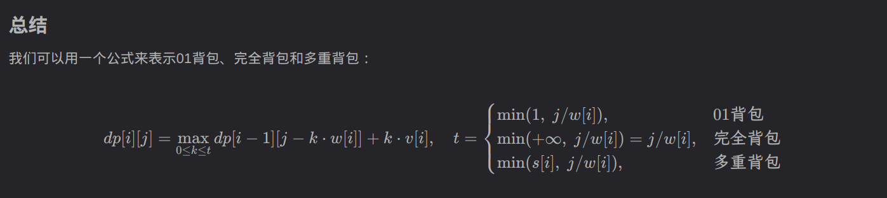

<!-- ```json -->

${toc}


1e5 is 100000 bushi 10000
n, n != n, m
!= & == 
i & n

无向边，有向边

## 常用工具 

- 前缀和

| Property | Explaination                             |
|----------|------------------------------------------|
| 功能     | 可以在 $\Theta (1)$ 时间内求一段区间的和 |
| 用法     | sum[i] = sum[i - 1] + a[i]               |


- 滑动窗口
- 输入输出

```java
  public static void main(String[] args) throws Exception {

    BufferedReader br = new BufferedReader(new InputStreamReader(System.in));
    BufferedWriter bw = new BufferedWriter(new OutputStreamWriter(System.out));

    String[] values = br.readLine().split("\\s+");
    n = Integer.parseInt(values[0]);
    m = Integer.parseInt(values[1]);

    List<Integer> distinctSortedAlls = all.stream().distinct().sorted()
        .collect(Collectors.toList());

    int aftIdx = Collections.binarySearch(distinctSortedAlls, preIdx) + 1;

    Arrays.fill(h, -1);
    // read input

    bw.write(ret + "\n");
    bw.flush();
    bw.close();
    br.close();
  }
}
```

输入输出加速 

```java
public static StreamTokenizer in = new StreamTokenizer(new BufferedReader(new InputStreamReader(System.in), 32768));
  public static PrintWriter out = new PrintWriter(new OutputStreamWriter(System.out));

  public static double nextDouble() throws IOException {
    in.nextToken();
    return in.nval;
  }

  public static float nextFloat() throws IOException {
    in.nextToken();
    return (float) in.nval;
  }

  public static int nextInt() throws IOException {
    in.nextToken();
    return (int) in.nval;
  }

  public static String next() throws IOException {
    return in.sval;
  }

  public static long nextLong() throws Exception {
    in.nextToken();
    return (long) in.nval;
  }
```


### 字符串hash 


```java
 p[0] = 1;
 for (int i = 1; i <= n; i++) {
   p[i] = (p[i - 1] * P) % Q;
   h[i] = (h[i - 1] * P + c[i]) % Q;
 }

 while (m-- != 0) {
   int x = scan.nextInt();
   int y = scan.nextInt();
   int x1 = scan.nextInt();
   int y1 = scan.nextInt();

   long res = h[y] - h[x - 1] * p[y - x + 1];
   long res1 = h[y1] - h[x1 - 1] * p[y1 - x1 + 1];

   if (res == res1) {
     System.out.println("Yes");
   } else {
     System.out.println("No");
   }
 }

```

<++>


### 有关 模运算的 一些模板 

#### 最大公约数 

gcd short for greater common divisor

首先介绍一下 **模运算** 的定义。对于任意一个整数 $n$ , 一定存在两个整数 
$k, r$ 使得以下等式成立

$$
n = k * p + r
$$

那么我们定义$k$为$n$除以$p$ 的商\,  $r$为$n$除以$p$ 的余数, 这又可以表示为

$$
n \% p = r \qquad (n \text{ mod } p  = r)
$$

- 模运算的四则运算


- 辗转相除法求 gcd 

还是拿上文的等式举例

$$
n = k * p + r
$$

假设 $n$ 与 $p$ 有最大公因数 $m$, 等式两端同时 除以 $m$ 

$$
\frac{n}{m} = k * \frac{p}{m} + \frac{r}{m}  \\
\implies n' = k * p'  + \frac{r}{m}  \\
$$

由于 $n', p', k$ 都是整数, 所以 $\frac{r}{m}$ 也是整数，也就是说
$m$ 也是 $r$ 的因子。

$$
gcd(n, p) = gcd(p, r)
$$

#### 分解质因数 

```java
ArrayList<Integer> divide(long n) {
  ArrayList<Integer> factors = new ArrayList<>();
  for (int i = 2; i <= n / i; i++) {
    if (n % i == 0) 
    {
      factors.add(i);
      while (n % i == 0) n /= i;
    }
  }
  if (n > 1) {factors.add(x); factors.add(1); }
}
```


首先证明元素均为 $N$ 的素因数：因为当且仅当 `N % i == 0` 满足时，`result` 发生变化：储存 `i`, 说明此时 `i` 可以整除 $\frac{N}{A}$。说明存在一个数 $p$ 使得 $p \cdot i = \frac{N}{A}$ 。(其中, `A` 为 `N` 自身发生变化后遇到 `i` 时所除的数。此 `N` 非 彼 $N$ )。

其次证明 `result` 中的数均为素数。我们假定存在一个在 `result` 的合数 $K$ , 并根据整数基本定理 $K = K_1^{e_1} \cdot  K_2^{e_2} \cdots K_n^{e_n} \cdot$, 因为 $K_1 < K - 1$ 所以他一定会在 $K$ 前被遍历到。有因为 `while(N % k1 != 0) N /= k1`，即让 $N$ 没有了 素因子 `K1`， 顾遍历到 `K` 时，
`N` 和 $K$ 已经没有整除关系了。 

<!-- >  -->


#### 关于约数 


## 数据结构


### 单链表 

```java
  static int[] e = new int[N], ne = new int[N];
  // e[i] 可以被解读为 节点 i 对应的 值 为 e[i]
  // ne[i] 可以被解读为 节点 i 对应的 next 指针 指向 ne[i]
  static int idx;
  // idx 永远指向 下一个 存储位置
  static void init() {
    head = -1;
    idx = 0;
  }

  static void insert_head(int value) {

    e[idx] = value;
    ne[idx] = head;
    head = idx++;

  }

  static void remove_head() {
    head = ne[head];
  }

  // 在下标为 k 的节点后面 插入一个 值为 value 的节点
  static void insert(int k, int value) {
    e[idx] = value;
    ne[idx] = ne[k];
    ne[k] = idx;
    idx++;
  }

  // 删除 下标为 k 的节点后面的一个节点
  static void remove(int k) {
    if (k == -1) {
      remove_head();
    } else if (ne[k] != -1) {
      ne[k] = ne[ne[k]];
    }
  }
```


### 模拟队列

需要注意两点

1. hh 是队头， tt 是队尾
2. 从数组下标的层面看，hh 是要比 tt 小（或者等于的）。
所以 判断队列是否为空的语句是 `if(hh <= tt )` 

```java
public class Main {
    
    static int N = (int) (1e6 + 10);
    
    static int[] q = new int[N]; // q is queue
    static int hh = 0, tt = -1; // hh is head, tt is rear
    
    public static void main(String[] args) {
        Scanner scan = new Scanner(System.in);
        
        int n = scan.nextInt();
        while (n-- != 0){
            String op = scan.next();
            switch(op) {
                case "push":
                    q[++ tt] = scan.nextInt();
                    break;
                case "pop":
                    hh ++;
                    break;
                case "empty":
                    if (hh <= tt) {
                        System.out.println("NO");
                    } else {
                        System.out.println("YES");
                    }
                    break;
                case "query":
                    System.out.println(q[hh]);
            }
        }
        scan.close();
        
    }
}
```

### Trie
 
**功能： 可以快速在一组字符串中找到符合 某些 特殊条件 的一个或者 多个字符串** 

Trie 所用到的数据结构 

```cpp
int son[N][26]; // son[i] 可以读作 节点 i 的 孩子数组
// son[i][j] = u, 可以读作节点 i 的孩子 j 指向 u 这个节点 
// 为什么是 26 因为 这里只存储小写字符，小写字符一共 26 个

int cnt[N]; // cnt[i] 读作 以 i 节点 结尾的字符出现的次数。
int idx; // idx 同样是用来分配节点 
```

```java
static void insert(String ss) {
      int r = 0;
      
      for (int i = 0; i < ss.length(); i++) {
          int u = ss.charAt(i) - 'a';
          if (son[r][u] == 0) {
              son[r][u] = idx;
              idx++;
          }
          r = son[r][u];
      }
      cnt[r] ++;
  } 
    
  static void query(String ss) {
      
      int r = 0;
      
      for (int i = 0; i < ss.length(); i++) {
          int u = ss.charAt(i) - 'a';
          
          if (son[r][u] == 0) {
              System.out.println("0");
              return;
          } else {
              r = son[r][u];
          }
      }
      
      System.out.println(cnt[r]);
      
```

ps: 使用数组实现 Trie 就是 CS61B 里 讲解trie 提到的 naive approach, 
算法比赛可以这么写，但是如果实际开发里中 这么写 内存是要爆炸的。


#### 最大异或和 A143

思路：

1. 将整数转换为2进制数串，插入 Trie 中。(止步于此)
2. 从 1 .. n 遍历， 在 Trie 中查询 与 a[i] 异或结果最大的数异或结果与 res 比较大小， 保存较大者。（可见 Trie 这个数据结构的能力是在一组字符串中，找到某个具有特殊性质的字符串）
3. 输出结果

这道题的关键在于 query


#### A3585 最大异或和

思路：
1. 首先使用前缀和处理读入的数组，使得我们能用 $\Theta (1)$ 的时间复杂度计算 某段区间的 异或和 
2. 遍历 异或和数组 
  - 对于每一个数，首先在 Trie 中查找能与之产生最大异或的数
  - 计算异或结果，与res比较，保存最大值
  - 将该 数 插入 trie 中 
  - 若 $i \ge  m$ 那么从trie 中删除 sum[i - m]

如何实现删除：
1. 在插入时，为每一个节点增加一个 cnt 数据域，记录该节点下存在的字符串数目。
 - 插入时 cnt++
 - 删除时 cnt--

2. query 时， 增加一个 判断条件 cnt\[son\[r\]\[i\]\] > 0

### 二叉树的遍历 

#### 根据后序和前序构建二叉树

递归构建。
要点
1. 遍历数组下标从 1 开始比较好
2. 可以用 hash 表 存储 中序遍历 节点 与 下标的映射。因为分裂点是由 后序遍历的最后一个字母对应中序遍历的下标 确定的。
3. 将每一次函数递归的调用参数打印出来，再根据参数进行调整区间。(如果答案不正确的话)


## 字符串处理

### 循环移位找子串

判断一个字符串 a 是不是另一个字符串循环移位后的字串。

- 首先需要保证 a 的长度小于 b
- 之后令 b = b + b; 在拼接后的b串中使用 find 指令来判断 a 是否存在。

## 图 

### DFS 

DFS 问题
    重点在于 如何将实际问题抽象成一个 graph
    抽象成图后要明确 dfs 这个函数的含义是什么，再根据这个含义想目办里加东西。

#### A842 排列数字

其实就是 1, 2, 3 三个节点，两两相连形成一个无向图。求这个图的所用不同的便利方式


```cpp
#include <iostream>
using namespace std;

const int N = 7;
bool st[N + 1];
int path[N + 1];
int n; 

// dfs 函数：打印 以 u 为 第一个数的所有路径
void dfs(int u, int cnt) {
    
    // printf("dfs(%d, %d)\n", u, cnt);
    st[u] = true;
    path[cnt] = u;

    
    if (cnt == n) {
        for (int i = 1; i <= n; i++) {
            printf("%d ", path[i]);
        }
        printf("\n");
        return;
    }
    
    for (int i = 1; i <= n; i++) {
        if (st[i] == false) {
            dfs(i, cnt + 1);
            st[i] = false;
        }
    }
}

int main()
{
    cin >> n;
    for (int i = 1; i <= n; i++) {
        dfs(i, 1);
        st[i] = false;
    }
}
```

### BFS

分析搜索问题主要遵循以下步骤：
1. 定义 fringe 使用的 数据结构
2. 将实际问题抽象成 代码中的 一个状态
3. 如何获取 每一个 状态的 后续状态
4. 如何判断 状态是否处于 目标状态
5. 注意不要回溯 记录搜索状态

#### A844 BFS

不能使用数组来存取对应节点的父节点，因为可能如果后续节点又扩展了原始节点，
那么根据我们的算法逻辑， 原始节点的父节点也会被更改。

- 定义 fringe 使用的 数据结构

    queue
  
- 将实际问题抽象成 代码中的 一个状态 

    class Pair

- 如何获取 每一个 状态的 后续状态

```java
int[] dx = {0, 1, 0, 1}, dy = {-1, 0, -1, 0};
for (int i = 0; i < 4; i++) {
  int nx = front.x + dx[i], ny = front.y + dy[i];
  // check if (nx, ny) legal 
}
```

```cpp
#include <stdio.h>
#define N 110

int maze[N][N]; // maze[i][j] means the value in the row i, colunm j
int d[N][N]; // means the path taken from pos(0, 0) to pos(i, j);

typedef struct {
    int x, y;
} node;

node q[N * N];
int hh = 0, tt = -1;

int dx[] = {-1, 0, 1, 0};
int dy[] = {0, -1, 0, 1};

int n, m;


void bfs() 
{
    memset(d, -1, sizeof d);
    
    d[0][0] = 0; 
    node entry = {0, 0};
    q[++tt] = entry;
    
    
    while (hh <= tt) 
    {
        node top = q[hh++];
        
        // printf("(%d %d)\n", top.x, top.y);
        
        if (top.x == n - 1 && top.y == m - 1) {
            printf("%d\n", d[n - 1][m - 1]);
            return;
        }
        
        for (int i = 0; i <= 3; i++) {
            int x = dx[i], y = dy[i];
            node expand;
            expand.x = top.x + x;
            expand.y = top.y + y;
            
            if (expand.x >= 0 && expand.x <= n - 1 && \
             expand.y >= 0 && expand.y <= m - 1 && \
             maze[expand.x][expand.y] == 0 && d[expand.x][expand.y] == -1) {
                // printf("enqueue(%d, %d), maze %d\n", expand.x, expand.y, maze[expand.x][expand.y]);
                q[++tt] = expand;
                d[expand.x][expand.y] = d[top.x][top.y] + 1;
            } 
        }
    }
}

int main(void)
{
    scanf("%d %d", &n, &m);
    for (int i = 0; i < n; i++) {
        for (int j = 0; j < m; j++) {
            scanf("%d", &maze[i][j]);
        }
    }
    
    bfs();
}
```

<++>


- 如何判断 状态是否处于 目标状态

#### A845 八数码

bfs 求 最短路径问题需要注意两点
1. 如何存储 队列
2. 如何记录每一个状态的距离 (也就是 这个节点是第几层展开的)

- 状态表示
  * 使用字符串来表示每一个节点的状态 "123456X78"


### 树

#### A846 树的重心

何为重心：
重心是指树中的一个结点，如果将这个点删除后，剩余各个连通块中点数的最大值最小，那么这个节点被称为树的重心

通俗的来讲，就是删除树中的某一个节点后，会产生许多连通分量; 
如果这个节点是重心的话，连通分量的最大值最小。

可以用 dfs 的方式来统计

dfs 的 模板如下

```cpp
int dfs(int u) {
    st[u] = true;
    for (int j = h[u]; j != -1; j = ne[j]) {
        int i = e[j];
        if (!st[i]) {
            dfs(i);
            // 可以在这里对 dfs 得到的结果处理
        }
    }
}
```

在本题中， dfs(u) 是用来寻找 以节点 u 为根的所有子树的 节点 的数量。

dfs 就和 dp 类似，要搞清楚不同的 dfs 在不同题目下的含意是什么。

#### 树的层次遍历


### 拓扑排序

有关图的性质

- 有向无环图一定能够找到一条拓扑序列
- 有环图不存在拓扑序列

所以 拓扑排序可以检测 环路


**拓扑排序算法步骤:**

$$
\begin{align*}
  &\text{Init queue，将临界表中所有入度为0的点加入队列} \\
  & \text{while queue not empty: } \\
  & \qquad  \text{front = queue.poll()}   \\ 
  & \qquad  for \text{ edge (front, j) } in \text{ graph[front] } \\ 
  & \qquad \qquad del \, (\text { front, j })  \\ 
  & \qquad \qquad if \text { degree[j] } == 0 \\ 
  & \qquad \qquad \qquad \text{ queue.enque(j) } \\ 
\end{align*}
$$

解题需要使用到邻接表，由于官方提供的stl库效率不是很高。
我们考虑用数组来模拟邻接表。

```cpp
int h[N]; // 该数组储存头节点。h[i] 可以理解为 节点 i 在邻接表中 所对应的 那一条链表的 头节点
int e[N], ne[N], idx; // 老朋友了，参见单链表
int d[N]; // 该数组储存节点的入度。d[i] 可以理解为 第 i 个节点的 入度为 d[i]
int q[N];

// 模拟邻接链表 
static void add(int a, int b, int c) {
  e[idx] = b; // idx.e = b
  ne[idx] = h[a]; // 令 idx.next = a.head;
  h[a] = idx++; // update a.head = idx;
}
```

核心代码

```java
 static void tsort(int n) {
    for (int i = 1; i <= n; i++) {
      if (d[i] == 0) {
        q[++tt] = i;
      }
    }

    while (hh <= tt) {
      int front = q[hh++];

      for (int i = h[front]; i != -1; i = ne[i]) {
        int j = e[i]; // 并不真的需要从链表中把数删除
        d[j]--;
        if (d[j] == 0) {
          q[++tt] = j;
        }
      }
    }

    if (tt == n - 1) {
      for (int i = 0; i < n; i++) {
        System.out.println(q[i] + " ");
      }
    } else {
      System.out.println("-1");
    }

  }
```
模板易错点

1. 没有初始化头结点数组 `h[N]` 
2. 使用数组模拟队列时，没有正确对 `hh` 和 `tt` 赋值
3. 使用 优先队列 时，注意使用头文件 `queue` 。`greater` 是小根堆，`less` 是大根堆
4. 没能理解 数组模拟链接链表的 内涵。(请参见上文) 
5. 没能理解 N, M。有关图节点的数组初始化大小为 N， 有关链接链表节点大小初始化为 M

### Dijkstra

**适用条件** 

> 迪杰斯特拉算法适用于求正权有向图中，源点到其余各个节点的最短路径。注意：图中可以有环，但不能有负权边


算法思路：

$$
\begin{align*}
  &\text{dist[1]} = 0, \text{dist[i]} = +\infty  \\
  & for  \text{ i }  in  \text{ 1 .. n }   \\ 
  & \qquad \text{find node \textbf{t}  that has minimum distance and not visited in dist array}  \\ 
  & \qquad \text{ set visited[t] } = \text{true}  \\ 
  & \qquad \text { update weight for node that t can traverse to }\\ 
\end{align*}
$$


#### 朴素版 A849


#### 堆优化 A850

```java
  // 遗忘
  static void add(int a, int b, int c) {
    e[idx] = b; // idx.e = b
    ne[idx] = h[a]; // 令 idx.next = a.head;
    w[idx] = c;

    h[a] = idx++; // update a.head = idx;
  }

```

```java


  static int dijkstra() {

    Queue<int[]> q = new PriorityQueue<int[]>(n, (a, b) -> {
      return a[1] - b[1];
    });

    Arrays.fill(dist, INF);
    q.offer(new int[] { 1, 0 });
    // init for head;

    while (q.size() > 0) {
      int[] t = q.poll();
      int ver = t[0];
      int dis = t[1];
      st[ver] = true;

      for (int j = h[ver]; j != -1; j = ne[j]) { // h[i] 的含义没有理解透彻 遍历邻接表
        int node = e[j];
        if (dist[node] > dis + w[j]) { // 会 溢出

          // System.out.printf("dist[%d] = %d > t.dist = %d + w[%d] = %d\n", node,
          //     dist[node], dis, j, w[j]);

          dist[node] = dis + w[j];
          q.offer(new int[] { node, dist[node] });
        }
      }
    }

    return dist[n] == INF ? -1 : dist[n];

  }

```

### spfa


算法思路：

$$
\begin{align*}
  &\text{dist[1]} = 0, \text{dist[i]} = +\infty, \text{queue.enqueue(1)}, \text{st}[1] = 1    \\
  & for  \text{ i }  in  \text{ 1 .. n }   \\ 
  & \qquad \text{取对头元素}  \\ 
  & \qquad \text { update weight for node that t can traverse to }\\ 
  & \qquad \qquad \text{if update, enqueue and mark}   \\ 
\end{align*}
$$

#### 1488 最短距离

dijkstra 算法是求一个点 到 其他所有点的最短距离。

本题是 求所有点到 到 k 个商店的最短距离。

将这个 k 个商店 合并成一个点，就可以转化为 dijkstra 问题。


#### 854 floyd 求最短路

1. 初始化，对角线 := 0, 其他 := INF
2. 读取 边长，注意有重边
3. 求最小值
    - 注意 k 在外层循环
    - 更新思路为：直接从 节点 i 到 节点 j 会比 借助 节点 k 到节点 j 更划算吗 (i -> j compared with i->k->j)？

```cpp
#include <stdio.h>
#include <string.h>

#define N 210
#define INF 0x3f3f3f3f

int g[N][N];

int n, m, k;

void floyd()
{
    for (int k = 1; k <= n; k++) {
        for (int i = 1; i <= n; i++) {
            for (int j = 1; j <= n; j++) {
                if (g[i][j] > g[i][k] + g[k][j]) {
                    g[i][j] = g[i][k] + g[k][j];
                }
            }
        }
    }
}

int main()
{
    
    // 初始化，对角线 := 0, 其他 := INF
    memset(g, 0x3f, sizeof g);
    scanf("%d %d %d", &n, &m, &k);
    for (int i = 1; i <= n; i++) 
        for (int j = 1; j <= n; j++)
            if (i == j) 
                g[i][j] = 0;
            
    // 读取 边长，注意有重边
    while (m--)
    {
        int x, y, z;
        scanf("%d %d %d", &x, &y, &z);
        g[x][y] = g[x][y] < z ? g[x][y]: z; 
    }
    
    // 求最小值
    floyd();
    
    // 读取询问
    while(k--)
    {
        int x, y;
        scanf("%d %d", &x, &y);
        if (g[x][y] <= INF / 2) 
            printf("%d\n", g[x][y]);
        else 
            printf("impossible\n");
    }
    
    return 0;
}
```

### 最小生成树

#### 858 Prim 算法


1. 初始化 dist ($\infty$), state (0), pre (-1); 
    - dist[i] 表示节点 `i` 距离连通部分的距离为 `dist[i]`。仅当 `state[i]` 为0时有意义
    - state[i] 表示节点 `i` 的状态为 state[i] (0 表示还未连通)
    - pre[i] 表示节点 `i` 与 节点 `pre[i]` 相连。

2. 将 节点 1 加入 连通集合 (dist[1] = 0, state[1] = 1);
3. 循环 

$$
\begin{align*}
  & for  \text{ i }  in  \text{ 1 .. n }   \\ 
  & \qquad \text{find the closet node \textbf{t} to the connected region (and not connected)}  \\ 
  & \qquad \text{ set state[t] } = \text{true}  \\ 
  & \qquad \text { update pre and dist array for node that t can traverse to }\\ 
\end{align*}
$$

注意 无向边，有向边。
因为 单向连接不算连通的。


```cpp
void prim()
{
    dist[1] = 0;
    // state[1] = true;
    
    for (int i = 1; i <= n; i++) 
    {
        // check point 
        int minn = -1, minw = INF;
        for (int j = 1; j <= n; j++) 
        {
            if (state[j] == false && dist[j] < minw) 
            {
                minw = dist[j];
                minn = j;
            }
        }
        
        // printf("choose node %d with wight %d\n", minn, minw);
        
        state[minn] = true;
        
        //check point: update
        for (int j = 1; j <= n; j++) 
        {
            if (g[minn][j] != INF && state[j] == false && dist[j] > g[minn][j]) // == & !=
            {
                //printf("updateing node= %d w= %d pre= %d\n", j, g[minn][j], minn);
                dist[j] = g[minn][j];
                pre[j] = minn;
            }
        }
    }
}
```


## Dynamic Programming

动态规划分析步骤 

1. Define Objective function
2. Identify base cases
3. Write down a recurrence relation for the optimized Objective function
4. What is the order of exeution
5. where to look for answear

### 背包问题


有限集合找最值

1. 状态表示 (Objective function) f(i, j) 
  - 集合 最主要是把目标函数的集合表示出来，然后再考虑划分
  - 属性
2. 状态计算

#### 01 背包问题

$$
\begin{align*}
    f(i, j) = \underset{0 \le  k \le  \text{min}(1,  j / v[j]) }{\text{max} } (f( i-1, v - k * v[i] ) + k * w[i])
\end{align*}
$$

#### 完全背包问题

朴素解法
1. Define Objective function

    f[n][volume] 从1到n个物品选，使得背包体积小于等于volume，所能达到的最大价值

2. Identify base cases

    f[0][0] = 0,

3. Write down a recurrence relation for the optimized Objective function

$$
\begin{align*}
  f(i, j) = \underset{0 \le  k \le  j / v[j]}{\text{max} } (f[i-1][v - k * v[i]] + k * w[i])
\end{align*}
$$


4. What is the order of exeution

    Down to Top

5. where to look for answear

    f[n][v]


优化解法
1. Define Objective function

    f[volume] 背包体积小于等于volume时，所能达到的最大价值
2. Identify base cases

    f[0] = 0,
3. Write down a recurrence relation for the optimized Objective function

我们已知 ($v$ 指代 $v_i$，$w$ 指向 $w_i$)
$$

\begin{align*}
  f(i, j) &= \underset{0 \le  k \le  j / v[j]}{\text{max} } (f[i-1][v - k * v[i]] + k * w[i]) \\
      &= \text{max} (f(i-1, j), f(i-1, j - v) + w, \\ 
          & \qquad \qquad f(i-1, j - 2\cdot v) + 2\cdot w, \cdots , f(i-1, j - k\cdot v) + k\cdot w) \\
\end{align*}
$$

又因为有

$$
\begin{align*}
  f(i, j - v) &= max(f(i-1, j - v) , \\ 
          & f(i-1, j - 2\cdot v) + w, \cdots , f(i-1, j - k\cdot v) + (k - 1)\cdot w) \\
\end{align*}
$$

使用 $f(i, j - v)$ 进行变量代换，我们可以得到化简式

$$
\begin{align*}
  f(i, j ) &= max(f(i-1, j), f(i, j - v) + w)
\end{align*}
$$
4. What is the order of exeution

    Down to Top
5. where to look for answear

    f[v]


#### 多重背包问题 

最初无法理解 如何判断某一个物品有没有使用完

最后发现完全不需要判断，最里层的循环 (k), 已经遍历了所有可能的情况，不再需要单独跟踪。

举一个实际的例子。

假设 n = 1, v = 2 时，产生最大价值的 k 等于 aa, 而我们一共有bb 个物品 1, 那么做了上述决策后， 
剩下的物品1有 bb - aa个。而 bb - aa 这个值对我们的后续决策完全没用，所以我们不需要记录，我们的选择对物品个数的影响。

朴素解法
1. Define Objective function

    f[n][volume] 从1到n个物品选，使得背包体积小于等于volume，所能达到的最大价值

2. Identify base cases

    f[0][0] = 0,

3. Write down a recurrence relation for the optimized Objective function


$$
f[i][j] = \underset{0 \le  k \le  \text{min}(j / v[i], s[i])}{\text{max} } (f[i-1][v - k * v[i]] + k * w[i]) % k from 0 to v / k
$$

4. What is the order of exeution

    Down to Top

5. where to look for answear

    f[n][v]


二进制优化

将每一个物品按照 二进制 拆分, 比如假设 i 物品 有 10个

那么 s[i] = 1 + 2 + 4 + 3; 将 10 i 物品，拆分成4组新物品 

```cpp
for (int i = 1; i <= n; i++) {
    for (int t = 1; (s[i] - t) > 0; t *= 2){
        goods.push_back({v[i] * t, w[i] * t});
        s[i] -= t;
    }
    goods.push_back({v[i] * s[i], w[i] * s[i]});
}
```


#### 分组背包问题 

处理方式和 多重背包问题 一模一样 


####  整数拆分 

<font color='red'> 错误解法 </font> 

- Define Objective function

    $f(n)$ 整数n 最多有多少种拆分方式 
- Identify base cases

    $f(0) = 0$, $f(1) = 1$  
- Write down a recurrence relation for the optimized Objective function

    $f(n) = \sum (f(n - 2^0) + f(n - 2^1) + \cdots + f(n - 2^k))$, 其中 $k = \lfloor \log2 (n) \rfloor$ 
- What is the order of execution

    bottom to top 
- where to look for answer

    $f(n)$ 


<font color='green'> 正确解法 </font>

- Define Objective function

    f(i, j) 在前i个物品里选，使得体积恰好为 j 的方法数 
- Identify base cases

    f[0][0] = 1
- Write down a recurrence relation for the optimized Objective function

$$
f(i, j) = \underset{0 \le m \le j / v[i]}{\text{sum}} f(i - 1, j - m * v[i])
$$
    
- What is the order of execution

    Bottom to Top
- where to look for answer

    f[m][n] 其中 $m = \lfloor \log2 (n) \rfloor$


<font color='blue'> 时间优化 </font> 

我们已知 ($v$ 指代 $v_i$)

$$

\begin{align*}
  f(i, j) &= \sum (f[i-1][v - k * v[i]]) \\
      &= (f(i-1, j) + f(i-1, j - v) + \\ 
          & \qquad \qquad f(i-1, j - 2\cdot v) +  \cdots ) \\

\end{align*}
$$

又因为有

$$

\begin{align*}
  f(i, j - v) &= (f(i-1, j - v) + f(i-1, j - 2*v) +  \\ 
          & \qquad \qquad f(i-1, j - 2\cdot v) +  \cdots ) \\

\end{align*}

$$

使用 $f(i, j - v)$ 进行变量代换，我们可以得到化简式

$$
\begin{align*}
  f(i, j) &= f(i-1, j) + f(i, j - v) 
\end{align*}
$$

<font color='blue'> 空间优化 </font> 

我们可以将 `f(i, j) = f(i - 1, j) + f(i, j - v)` 优化为 `f(j) = f(j) + f(j - v)`。
这是因为我们是从小到大遍历 体积的，在计算`f(j)` 时, `f(j - v)` 已经被更新，所以 在更新 `f(j)` 前，
`f(j)` 是上一层的`j` (即 `i-1` 层), `f(j- v)` 已经被覆盖了，是当前层(即第 `i` 层)的 `j - v`。

由此我们发现，优化前和优化后，两个表达式是完全等价的。


#### 总结

背包的适用场景： 有限制的选择问题

- 01 背包问题 <--> 多重背包问题 <--> 分组背包问题
- 完全背包问题 



### 线性 dp

#### A898 数字三角形 

路径问题，状态表示一般都用 坐标

- Define Objective function

    f(i, j), 以 坐标(1, 1) 为起点，(i, j) 为终点的路径最大值  
- Identify base cases

    $$
    f(i,j ) = \begin{cases}
       0 &\qquad i = 0, j = 0  \\
       -\infty &\qquad other
    \end{cases}
    $$
    
- Write down a recurrence relation for the optimized Objective function

$$
f(i, j) = \text{max}(f(i - 1, j - 1), f(i - 1, j))
$$


- What is the order of execution

    Down to Top 
- where to look for answer
 
  $$
  \underset{1 \le k \le n}{\text{max} } (f(n, k));
  $$
  
#### A895 最长上升子序列

- Define Objective function

    f(i), 以第i个数结尾的单调递增子序列 （个数） 
- Identify base cases

    $f(i) = 1 \quad (1 \le i \le n)$ 
- Write down a recurrence relation for the optimized Objective function

$$
f(i) = \begin{cases}
   \text{max} (f(i), f(j) + 1) &\quad a[i] > a[j], 1 \le j < i  \\
   f(i) &\quad otherwise
\end{cases}
$$

- What is the order of execution
- where to look for answer

#### A897 最长公共子序列 

难点：不太好进行 状态表示


- Define Objective function

    f(i, j) 表示 A[1 $\sim$ i], B[1 $\sim$ j] 的最大公共子序列集合 
- Identify base cases

    f(0, 0) = 0
- Write down a recurrence relation for the optimized Objective function

$$
f(i, j) = \begin{cases}
\text{max} (f(i - 1, j), f(i, j - 1), f(i - 1, j - 1) + 1) & \quad a[i] == b[j] \\
\text{max} (f(i -1, j), f(i, j - 1))   &  otherwise \\ 
\end{cases}
$$
    
    
- What is the order of execution

    Down to Top 
- where to look for answer

    f(n, m)


状态转移方程解释：
集合划分方式： 根据两个字串的最后一个字符来划分 

若 a[i] == b[i], 那么由 A[i], B[j] 构成的 公共子序列必定包含 a[i] 与 b[i],
问题就转化为 求 f(i -1, j -1) 的最长公共子序列

若 a[i] != b[i], 那么两个字符里面一定有一个可以抛弃的，可以对
f(i -1, j), f(i, j -1) 两种状态取 max 来转移 


```cpp
int main()
{
    int n, m;
    cin >> n >> m;
    for (int i = 1; i <= n; i++) {
        cin >> a[i];
    }
    getchar();
    for (int i = 1; i <= m; i++) {
        cin >> b[i];
    }
    
    for (int i = 1; i <= n; i++) {
        for (int j = 1; j <= m; j++) {
            f[i][j] = max(f[i - 1][j], f[i][j - 1]);
            if (a[i] == b[j]) f[i][j] = max(f[i - 1][j - 1] + 1, f[i][j]);
        }
    }
    
    cout << f[n][m];
    
    return 0;
}
```

#### A899 编辑距离 

难点：状态表示难以想到。
难以写出状态转移方程，不知道如何划分集合

集合划分方式：
- Define Objective function

    f(i, j) 表示 将 A[1 $\sim$ i] 变为 B[1 $\sim$ j] 所需要的最少步骤，
    也可以理解为，经过 f(i, j)步骤后，A[1 .. i] 已经和 B[1 .. j] 完全一样
- Identify base cases

$$
f(i, 0) = i \qquad (1 \le i \le n) \\
f(0, j) = j \qquad (1 \le j \le m)
$$

- Write down a recurrence relation for the optimized Objective function

$$
f(i, j) = \begin{cases}
\text{min} (f(i - 1, j) + 1, f(i, j - 1) + 1, f(i - 1, j - 1) + 1) & \quad a[i] != b[j] \\
\text{min} (f(i - 1, j) + 1, f(i, j - 1) + 1, f(i - 1, j - 1) + 0) & \quad a[i] == b[j] \\
\end{cases}
$$

- What is the order of execution
- where to look for answer


状态转移方程解释:

f(i, j) 可以分解为 4 个 子问题。

如果 A[1 .. i - 1] 已经和 B[1 .. j] 完全一致 （也即 经过了 f(i-1, j) 步）,
那么只需要将 a[i] 删除即可。

如果 A[1 .. i] 已经和 B[1 .. j - 1] 完全一致 （也即 经过了 f(i , j - 1) 步）,
那么只需要 增加一个 b[j] 即可。


如果 A[1 .. i - 1] 已经和 B[1 .. j - 1] 完全一致 （也即 经过了 f(i - 1 , j - 1) 步）, 如果 a[i] 不等于 b[i], 就修改一次，如果 a[i] == b[i] 不做任何操作

<font color='red'> 虽然 f(i, j) 只是一个数，但是要认真考虑其背后的意义 </font> 


#### A1051 最大的和 


- Define Objective function

    
- Identify base cases
- Write down a recurrence relation for the optimized Objective function
- What is the order of execution
- where to look for answer

### 树形 dp 

#### A285 没有上司的聚会

- Define Objective function

    1. $f(u, 0)$ 从所有以u为根的子树选择，并且不选u这个点的方案数 
    2. $f(u, 1)$ 从所有以u为根的子树选择，并且选u这个点的方案数

  (求确定的集合的最大值)

- Identify the base case

    f[u][1] = happy[u]

- Write down a recurrence relation for the optimized Objective function

    设 u 的孩子数组为v
$$
f(u, 0) = sum \big( max(f(v_1, 0), f(v_1,1)) +  max(f(v_2, 0), f(v_1, 1)) + \cdots \big)
$$

$$
f(u, 1) = sum (f(v_1, 0) + f(v_2, 0 ) + \cdots + f(v_n, 0))
$$

- What is the order of execution

    Top to Down 

- where to look for answer

    max(f(root, 0), f(root, 1))


#### A1072 最大路径和 

<font color='red'> Naive Approach, 复杂度</font>  $\Theta(n^2)$ 会超时

- Define Objective function

   1. f(u, 0) 以u为根节点，且不选u这个节点的路径方案数
   2. f(u, 1) 以u为根节点，且选u这个节点的路径方案数

   (求确定方案集合的最大值)

- Identify base cases

    f(u, 1) = w[u]

- Write down a recurrence relation for the optimized Objective function

  设 u 的孩子数组为 v, 假设有 n 个孩子

$$
f(u, 0) = \underset{1 \le j \le n}{max} (f(v_j, 0), f(v_j, 1))
$$

$$
f(u, 1) = \text{max} (w[u], w[u] +  \underset{1 \le j \le n}{max} ( f(v_j, 1)))
$$

- What is the order of execution

    Top to Bottom

- where to look for answer

    $\underset{1 \le i \le  n}{\text{max}}(\text{max} (f(i, 0), f(i, 1)))$


$Q$: 为什么上面这种算法需要遍历每一个顶点，才能找到最大值。

$A$: 因为这里的边都是无向边，每一个节点都可以作为根节点，这和 A285 题有所不同 


<font color='green'> 正确解法 </font> 


### 区间 dp 

> 凡是和操作数有关系的，都需要关心 dp 函数对 序列造成的影响。

#### A282 石子合并 

- Define Objective function

    f(i, j) 将 i $\sim$ j 之间的区间合并所需要的方案数 (也可以理解为区间$[i, j]$ 这段石子，经过 $f(i, j)$ 步后，已经合并成一堆石子了) 
    求 最小值 

- Identify base cases

$$
f(i, j)\begin{cases}
  0 & \text{if } i=j \\
  \infty & \text{otherwise} 
\end{cases}
$$

- Write down a recurrence relation for the optimized Objective function

$$
f(i, j) = \underset{0 \le k \le j - i - 1}{\text{min}} (f(i, i + k), f(i + k + 1, j))
$$


 

- What is the order of execution

    Bottom to Top

- where to look for answer

    f(1, n)


区间dp 模板 

```cpp
for (int len = 1; len <= n; len++) {         // 区间长度
    for (int i = 1; i + len - 1 <= n; i++) { // 枚举起点
        int j = i + len - 1;                 // 区间终点
        if (len == 1) {
            dp[i][j] = 初始值
            continue;
        }

        for (int k = i; k < j; k++) {        // 枚举分割点，构造状态转移方程
            dp[i][j] = min(dp[i][j], dp[i][k] + dp[k + 1][j] + w[i][j]);
        }
    }
}
```


### 状态压缩dp 

#### 最短哈密顿路径 

- Define Objective function

    $f(i, j)$ 所有从 $0$ 走到 $j$ ，走过的路径存在 $i$ 中。 
    求最小值 

- Identify base cases

$$
f(i, j) = \infty \qquad \text{iff }  (i, j) \ne (1, 0) \\ 
f(1, 0) = 0 
$$

$Q:$ 为什么 $f(0, 0)$ 等于 $\infty$ 

$A:$ 按照定义, $f(0, 0)$ 表示从起点到 0 这个点所经过的状态为 $i$, 但是 $i$ 的值是 $0$ ， 表示一个点都不经过，这与事实相悖（因为到达了 $0$ 这个节点, 所以 i 的值应该为 $1$） $(0 | 1 << 1 = 1)$

<!--   -->

- Write down a recurrence relation for the optimized Objective function


$$
f(i, j) = \underset{0 \le k \le n - 1}{\text{min}} \big( f(i - \{J\}, k)  \big)
$$


- What is the order of execution

    Bottom To Top

- where to look for answer

    f((1 << n) - 1, n)

<!--  -->

#### L21A04 回路计数 

- Define Objective function

    $f(i, j)$ 从 0 到达 j 节点的 路径 储存在 i 中 
    求 方案总和

- Identify base cases

$$
    f(i, j) = 0 \qquad \text{iff }   (i, j) \ne (1, 0)\\ 
    f(1, 0) = 1 
$$

- Write down a recurrence relation for the optimized Objective function

$$
f(i, j) = \underset{0 \le k \le n - 1}{\text{sum}} \big( f(i - \{J\}, k)    \big)
$$

- What is the order of execution

    Bottom To Top

- where to look for answer

    $\sum_{1 \le i \le n-1} f((1 << n) - 1, i)$  

<!-- _ -->

### 树状数组 

#### A3662 最大上升子序列 

<font color='red'> TLE </font> 

- Define Objective function

    f(i) 表示 $1 \sim i$ 中以 i 结尾的最长上升子序和 

- Identify base cases

    f(i) = a[i]

- Write down a recurrence relation for the optimized Objective function

$$
f(i) = \begin{cases}

\underset{1 \le j \le i - 1}{\text{max}} (f(i), a[i] + f(j)) & \text{if } a[i] > a[j]   \\

a[i] &
\end{cases}
$$
    
    
- What is the order of execution

    Bottom To Top 

- where to look for answer

   $\underset{1 \le i \le n}{\text{max} } (f(i))$


<font color='green'> 优化做法 </font> 


### 线段树

**Lead in**

线段树用于处理 对于 数组的区间查询。比如，求 数组 l - r 范围
内的和。

**build** 

线段树是一个二叉树，它的每一个端点都表示一段区间 (和一些区间的性质
，min | max | sum)


我们可以采用自低向上的方式，构建线段树。从叶子节点开始, 向者根节点的方向延伸。

每一个递归的过程中，都需要使用两个孩子节点的数据去形成一个父节点。
如何合并与具体题目有关。


**操作** 

线段树支持两种操作:

1. `update` 

每一次递归都选一个方向

2. `query` 

三种情况
- `l r start end`, `start end l r` 当前区间 `(start end)` 在 所求区间 `(l, r)` 之外  

    直接 `return` 一个无效值

- `l start end r` 当前区间 `(start end)` 在 所求区间 `(l, r)` 内部 

    直接 `return` 当前区间所保存的值 

- 当前区间 `(start end)` 与 所求区间 `(l, r)` 有交叉  

    递归求解 


**区间更新** 

懒标记，


**问题过程中遇到的问题** 

1. 递归时要加一个判断是否为 空的条件 
2. `<<` `>>` 搞混了
3. 基线条件记得return


### 双指针算法

#### leetcode 3

给定一个字符串 `s` ，请你找出其中不含有重复字符的 **最长子串** 的长度。


### 字符串查找

#### KMP

kmp 算法可以在 $\Theta(n)$ 查找 n 的子串。它的原理是，在子串查找之前，构建一个子串的 有限状态机, 用于避免回溯。

如何根据子串构建一个 DFA 呢。
DFA由状态和转换关系构成：

状态：
首先，子串的每一个字符都表示一个状态，所以 这个 DFA 的总状态数就是子串的长度，再加上最后的一个终止状态。
比如子串 `aaa` 的状态数就是 `3 + 1 = 4` 

- [ ] 此处应该画出 aaa 的状态表示

转换关系：
字符表中的字符，会使得 dfa 中的状态发生转换。这种转换可以分为两类

- [ ] 匹配转换， 可以移动到下一个状态
- [ ] 不匹配转换， 向之前的状态转移

如何构建 DFA 呢？ 

- 初始化
首先，`0` 状态 如果遇到 子串下标为 `0` 的字符，那么会向 状态 `1` 进行转化。如果是其他字符，那么就保持 `0`.
我们再考虑 `restart state` X 的初始值，如果在第一个字符处就不匹配，那么显然我们应该从 下标为 0 处 重新开始，所以 X 的初值为 0。

```cpp
dfs[pattern[0]][0] = 1; 
X = 0
```

- 开始预处理

对于之后的状态 i， i 从 1 开始。

- [ ] 如果发生匹配转换， 可以移动到下一个状态 (ch == pattern[i]) `dfs[ch][i] = i + 1` 
- [ ] 不匹配转换， 向之前的状态转移 `dfs[ch][i] = dfs[ch][X]` 

最后，利用 DFA 更新 `restart state` 

```cpp
X = dfs[pattern[i]][X]
```

X 构建的是 pattern[1: len] 的状态机 (这点还是难以理解)
