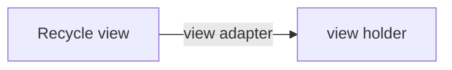

## Recycle View
## background infomation
- Recycle view
- Recycleview.viewholder
- Recycleview.adapter
- layout manager


## How to display a recycle view

- for adapter, we need to override
    - `onCreateViewHolder`
    - `onBindViewHoldr`
    - `getItemCount` 


```kotlin
package com.example.cornell

import android.view.LayoutInflater
import android.view.View
import android.view.ViewGroup
import androidx.recyclerview.widget.RecyclerView
import androidx.recyclerview.widget.RecyclerView.ViewHolder
import com.example.cornell.databinding.ActivityMainBinding
import com.example.cornell.databinding.BookRowItemBinding

class MyBookAdapter(
    private val dataSet: List<Book>,
    private val printPos: (Int) -> Unit
    ):
    RecyclerView.Adapter<MyBookAdapter.MyViewHolder>(){
    inner class MyViewHolder(val binding: BookRowItemBinding) : ViewHolder(binding.root)
    private var dataFiltered: List<Book> = dataSet;

    var filterTest: CharSequence = ""
        set(value) {
            field = value
            onFilterChange(value)
        }

    private fun onFilterChange(charString: CharSequence) {
        dataFiltered = if (charString.isEmpty()) {
            // There's no query, should return back the unfiltered list.
            dataSet
        } else {
            // The filter function returns a list containing only elements
            // matching the given predicate. In this case, we can choose
            // our predicate to be what we want to filter by. Since we are working
            // with books, let's allow filtering by author and title!
            dataSet.filter { book ->
                book.bookName.contains(charString) || book.author.contains(charString)
            }
        }

        notifyDataSetChanged()
    }
    override fun onCreateViewHolder(parent: ViewGroup, viewType: Int): MyViewHolder {
        val binding = BookRowItemBinding.inflate(LayoutInflater.from(parent.context))
        return MyViewHolder(binding)
    }

    override fun onBindViewHolder(holder: MyViewHolder, position: Int) {
        with(holder) {
            this.binding.button.setOnClickListener {
                printPos(position)
            }
            with (dataFiltered[position]) {
                binding.bookName.text = this.bookName
                binding.author.text = this.author
                binding.publisher.text = this.publisher
            }
        }
    }

    override fun getItemCount(): Int {
        return dataFiltered.size
    }
}

```
```java
package com.example.cornell

import android.content.Intent
import android.os.Bundle
import com.google.android.material.snackbar.Snackbar
import androidx.appcompat.app.AppCompatActivity
import androidx.navigation.findNavController
import androidx.navigation.ui.AppBarConfiguration
import androidx.navigation.ui.navigateUp
import androidx.navigation.ui.setupActionBarWithNavController
import android.view.Menu
import android.view.MenuItem
import androidx.recyclerview.widget.GridLayoutManager
import androidx.recyclerview.widget.LinearLayoutManager
import com.example.cornell.databinding.ActivityMainBinding

class MainActivity : AppCompatActivity() {

    private lateinit var binding: ActivityMainBinding

    override fun onCreate(savedInstanceState: Bundle?) {
        super.onCreate(savedInstanceState)
        binding = ActivityMainBinding.inflate(layoutInflater)
        val book_recycle_view = binding.bookList
        book_recycle_view.setHasFixedSize(true)
        book_recycle_view.layoutManager = GridLayoutManager(this, 2)

        val dataSet = mutableListOf<Book>();

        for (i in 1..20) {
            dataSet.add(Book("Harry Potter$i", "Lorin$i", "Wizard$i"))
        }
        book_recycle_view.adapter = MyBookAdapter(dataSet) {
            val intent = Intent(this, NextActivity::class.java)
            intent.putExtra("Pos", it.toString())
            startActivity(intent)
        }
        setContentView(binding.root)
    }
}

```
