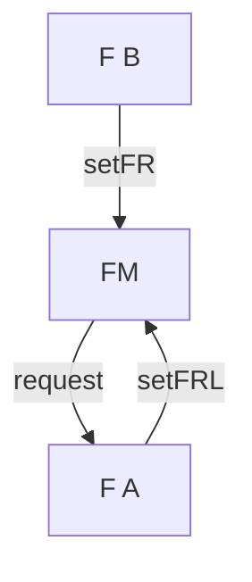

## lec 5
## Fragment

Why fragment
1. reuse 
2. reduce redundant

Lifecycle
1. tied to host activity

FragmentManager

FragmentTransactions
    - creating
    - launching
    - caching

group transaction

```
val fM = sFM;
fM.beginT
    .add(.., ..)
    .commit()
```



## Navigation
- Botton Navigation View
- TopBar
- 

