${toc}

```json
 
```

## 术语

| zh       | en              |      |
|----------|-----------------|------|
| 张量     | Tensor          | <++> |
| 标量函数 | Scalar fucntion | <++> |
| 全连接层 | full connected layer |  输出层中的神经元和输⼊入层中各个输⼊入完全连
接|
| 特征 | feature | 预测标签的因子 (权重) |
| 标签 | label | 真实值 |


## DL Lec 1

**some concepts** 

- `deep learning` is a subset of `machine learning`
- `machine learning` is a subset of `artificial intelligence`


The difference between DL and traditional ML

- 深度学习不需要人工提取特征，传统机器学习需要 

**Important factors(关键要素)** 

- 深度神经网络模型
- 大规模数据集
- 大规模计算资源 

> Q: 解释深度学习近几年火爆的原因 <br>
> A: 随着互联网的发展，网络上的语料和视频数据足够庞大
>     <br> GPU 的算力逐年增长 


**Classifying dataset** 

1. tranning Set
2. validating Set
3. test Set 

**genenralization (泛化)** 

- 过拟合 泛化误差大  
- 欠拟合 训练集上和测试集上效果都差  

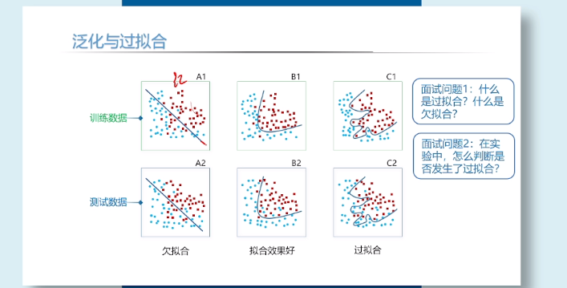

## lab1 环境配置

- 首先需要装 `anaconda`  

`yay -S anaconda`

- 换源

```
conda config --add channels https://mirrors.tuna.tsinghua.edu.cn/anaconda/pkgs/free
conda config --add channels https://mirrors.tuna.tsinghua.edu.cn/anaconda/pkgs/main
conda config --set show_channel_urls yes
```

- 加载配置文件 

`source /opt/anaconda/bin/activate root`


- 安装 `pytorch` 的库

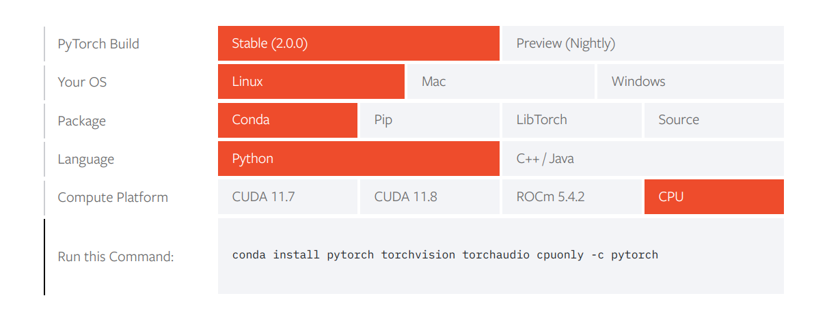

注意加上 `sudo` 因为要对 `/opt` 目录进行写入操作

- 测试 minst 数据集


## **动手学习深度学习第二章** 

## Lec 3 神经网络简介


**神经网络基本结构** 

- 输入层。表示原始输入数据，一般只有一层, 输入第一层记为神经网络的第0层
- 隐藏层。对输入数据进行 **非线性变换** ,以进行*特征提取和加工*，一般有多个隐藏层。
第一个隐藏层记为神经网络的第一层
- 输出层。表示分类的结果。要分成几类，输出层就有几个神经元, 输出层只有一层。

**神经网络的重要概念** 

- 输入
- 输出
- 激活函数
- 参数


> Q: 全连接神经网络中某一层的输入输出维度如何确定 <br>
> A: 输入维度由上一层神经元个数确定，输出维度由本层神经元确定 

**输入输出** 

$H_i^{(i)}$ 下标 i 表示第个神经原，上标 1 表示在第 I 层, 整个表达式含意为 第 I 层
第 i 个神经元的值

$w_{i j}^{(k)}$  i 表示前一层神经元的位置， j 表示后一层神经元的位置，k 表示在第 k 层
整个表达式的含意为 从 k - 1 层 的 第 i 个神经元 到 k 的第 j 个神经元的权值


$b_i^{(i)}$ 下标 i 表示第个神经原，上标 i 表示在第 i 层, 整个表达式含意为 第 i 层
第 i 个神经元的偏置的值 

计算公式

矩阵形式：

$$
h^{(i)} = h^{(i - 1)} \cdot W^{(i)} + b^{(i)}
$$

展开：

$$
(h_1^{(i)} ,h_2^{(i)}, \cdots h_n^{(i)}) = (h_1^{(i-1)} ,h_2^{(i-1)}, \cdots h_m^{(i-1)})  
\begin{bmatrix}
w_{11}^{(i)} & \dots & w_{1n}^{(i)}\\
  & \ddots & \vdots\\
w_{m1}^{(i)} & & w_{mn}^{(i)}
\end{bmatrix} + (b_1^{(i)} ,b_2^{(i)}, \cdots b_n^{(i)})
$$

**激活函数**

常见的激活函数有

- `softmax`  $\frac{1}{1 + e^{-x}}$  
- `tan(h(x))` $tan(x)$ 
- `ReLU` max(0, x)


$$
h^{(i)} = f(h^{(i - 1)} \cdot W^{(i)} + b^{(i)})
$$

> Q: 激活函数的作用是什么
> <br>A: 对神经网络加入非线性操作，增强神经网络的拟合能力，
> 如果不加入激活函数，那么隐藏层将退化为一层

最后对输入采用 `softmax` 函数进行处理。(保证数据范围在 (0, 1) 内, 且所有输出的值相加为一)

**常见训练模型** 


**神经网络-参数** 

全相连神经网络的参数分为两部分，权重和参数

权重数 = 上一层神经元 * 本层神经元
偏置数 = 本层神经元数量 

训练网络目的就是了找到合适的权重和偏置

**训练流程** 

初始化参数: 高斯随机

**神经网络训练总揽** 

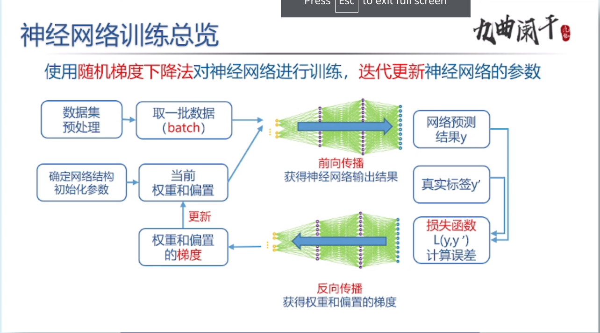

随机梯度📉
 
batch: 批, 计算一个 batch 即 一次迭代
    batch-size


epoch: 轮


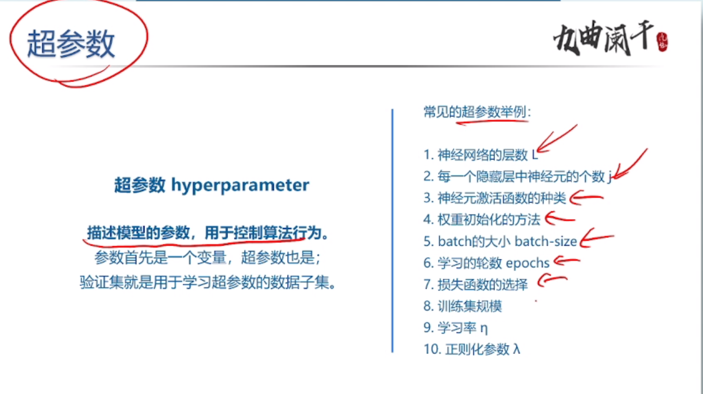

验证集测试

## lab2

作业: 

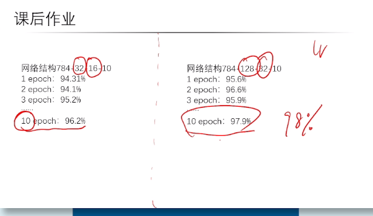

首先我们来实现一下课上所讲的 MNIST 数据集

- 第一步 定义网络结构

我们首先仅仅设置一个隐藏层

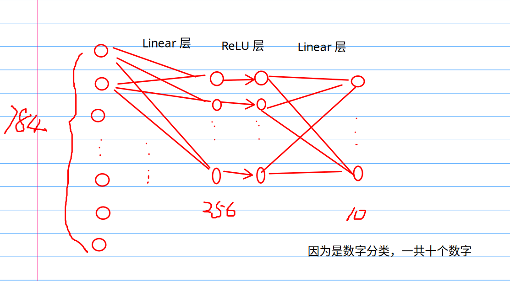

```py
class FCNet1(nn.modules):
    def __init__(self, **kwargs) -> None:
        super(FCNet1, self).__init__(**kwargs)

        self.hidden = nn.Linear(784, 256)
        self.active = nn.ReLU()
        self.output = nn.Linear(256, 10)

    def forward(self, ../img):
        hidden = self.hidden(../img)
        active = self.active(hidden)
        out = self.output(active)

        return out

```
- 加载数据集

```python
train_data = torchvision.datasets.MNIST(root='./data',
                                        train=True,
                                        download=False,
                                        transform=trans)

test_data = torchvision.datasets.MNIST(root='./data',
                                       train=False,
                                       download=False,
                                       transform=trans)

train_data_loader = data.DataLoader(
    dataset=train_data,
    batch_size=200,
    shuffle=True, # 每一次用同一个batch 都打乱顺序
    num_workers=4 # 工作核心
)

test_data_loader = data.DataLoader(
    dataset=test_data,
    batch_size=200,
    shuffle=False, # 每一次用同一个batch 都打乱顺序
    num_workers=4 # 工作核心
)

```

- 定义 loss function

`loss = nn.CrossEntropyLoss()`

- 定义 优化器

`optimizer1 = optim.SGD(net1.parameters(), lr=0.01)`

- 开始训练

```python

def train(net,
          train_iter,
          test_iter,
          loss,
          num_epochs=10,
          optimizer=None,
          device=None):

    n = 0 # 总数
    for epoch in range(1, num_epochs + 1):
        train_loss_sum, train_acc_sum = 0, 0
        for train_images, labels in train_iter:
            # 将数据存放在 CPU
            assert isinstance(train_images, torch.Tensor)
            assert isinstance(labels, torch.Tensor)
            # torch.Size([200, 1, 28, 28])
            train_images.to(device)
            labels.to(device)
            # torch.Size([200, 1])

            # forward
            output = net(train_images)

            los = loss(output, labels).sum()

            optimizer.zero_grad()

            # backward
            los.backward()
            optimizer.step()
            train_loss_sum += los

            # argmax(dim=1) 返回 一列元素最大的那个下标 (200 * 10)
            accruate = (output.argmax(dim=1) == labels).sum().item()
            train_acc_sum += accruate
            n += labels.shape[0]

        test_accuracy = test(net, test_iter)

        print(
            f'epoch {epoch}, train_loss {train_loss_sum / n}, train_accuracy {train_acc_sum / n}, test_accuracy {test_accuracy}'
        )
        n = 0

```

- 如何调整学习率

首先从 0.01 开始，按照 10 的次幂开始调整。

调整心路历程 `0.01 -> 0.1 -> 0.2 -> 0.15 -> 0.165`


### 有关 `autograd`


## 卷积神经网络

使用全连接神经网络， 会有哪些问题?
1. 计算量太大，复杂度太高
2. 丢失图像信息

**卷积神经网络的特点** 

1. 局部连接
2. 参数共享

**卷积核的作用** 


**interview** 

> 卷积层的局部连接特点指的是什么 

相当与 局部连接的 全连接层, 

> 卷积层的局部连接 有什么好处

减少参数数目, 提升计算速度

> 卷积层的 参数共享 特点指的是什么 

对于 不同的 图像位置,使用同一个卷积核 

> 卷积层的 参数共享 有什么好处 

不会丢失图像的局部信息

等边表示: 局部特征所处的位置 不会影响卷积的 结果?

**padding** 

因为经过卷积操作后, 得到的特征矩阵的维数会变小 $m = n - k + 1$,
为了保证 矩阵维数不变, 我们可以先对矩阵进行填充后,再做卷积运算. $p = \frac{k - 1}{2}$ 

- **Vaild 卷积** 不填充 

- **Sane 卷积** 填充, 不会丢失图像的边界信息

**卷积运算步长** 

进行运算时, 矩阵的偏移量

**多通道卷积运算** 

分成三个矩阵, 分别计算卷积, 最后将对应位置的数求和.

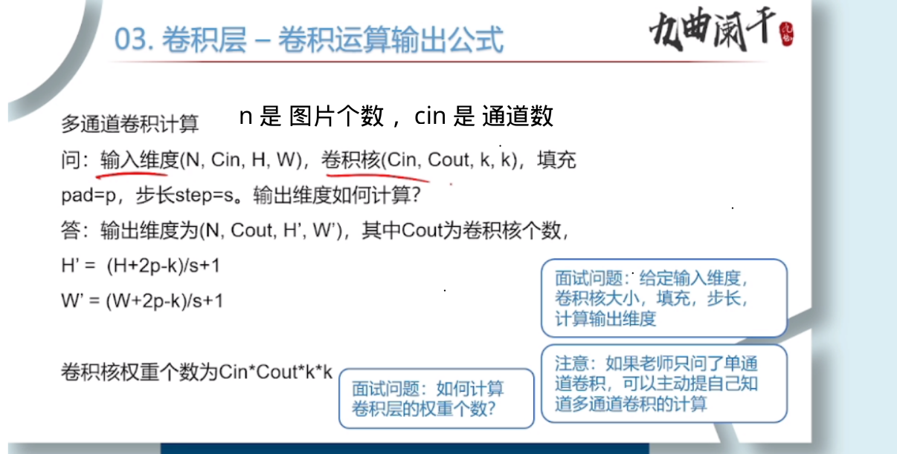

**池化层** 

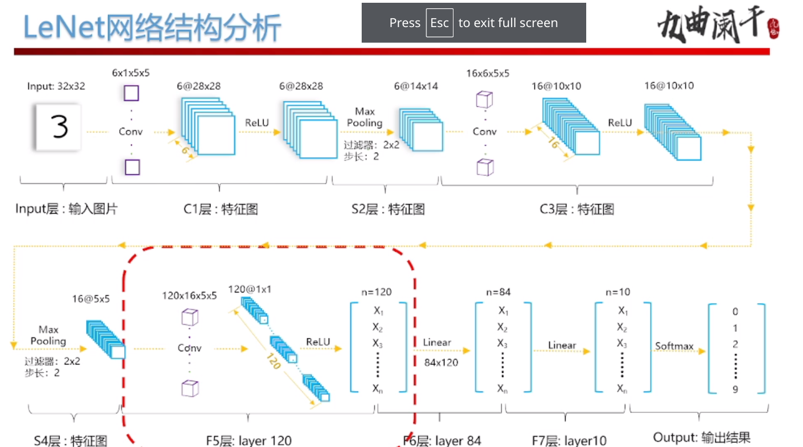
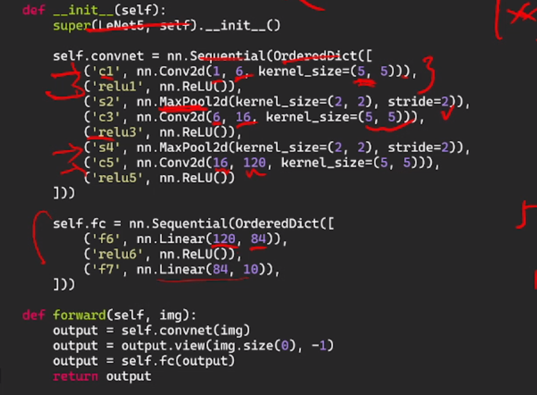

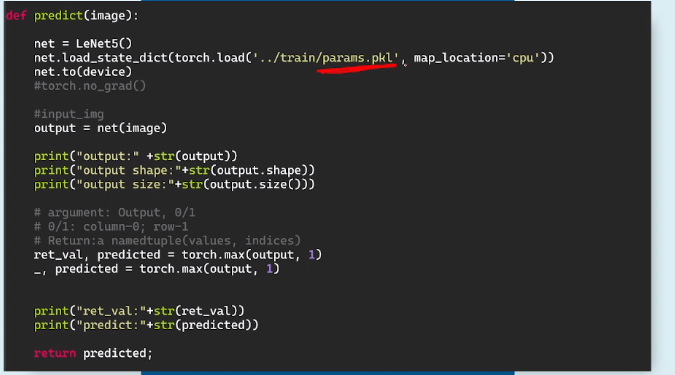

- 均值池化
- 最大池化

作用: 
1. 减少特征维度, (降维, 减少复杂度)
2. 保留主要特征


## 问题

1. `root='./data'`, 不要忘了 `.`
2. 有趣的 `id` 函数
    `id` 函数返回的实际上是 变量所储存的 对象的 地址， 而不是自身的地址?

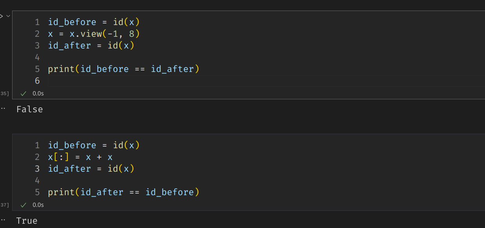

1. why update happens outside the net class ? 
2. where we store the value of the weight parameter ?

```py
for epoch in range(1, num_epoch + 1):
        train_loss_sum, train_acc_sum = 0, 0
        for train_images, labels in train_data_loader:
            # 将数据存放在 CPU
            assert isinstance(train_images, torch.Tensor)
            train_images.to(device)
            labels.to(device)

            breakpoint()
            # torch.Size([200, 1, 28, 28])

            # forward
            output = net(train_images)

            los = loss(output, labels).sum()

            optimizer.zero_grad()

            # backward
            los.backward()
            optimizer.step()
            train_loss_sum += los
```

- 注意 优化器 绑定了 一个网络的 所有参数。所以 一个优化器只能对应一个 网络结构。如果要在一个程序中 测试多个 网络结构的准确性，就需要定义多个网络结构。

以下面这个网络结构为例

```python
train(net=net1,
          train_iter=train_data_loader,
          test_iter=test_data_loader,
          loss=loss,
          num_epochs=10,
          optimizer=optimizer1,
          device=device)

    print("网络结构 784 - 32 - 16 - 10")
    train(net=net2,
          train_iter=train_data_loader,
          test_iter=test_data_loader,
          loss=loss,
          num_epochs=15,
          optimizer=optimizer1,
          device=device)

```

如果 两次训练的 优化器是一样的，那么第二次训练的过程中，你会发现 测试准确率是个定值。(因为优化器只会改变第一个网络结构的参数)


1. `lab3` 遇到的问题

- matXX and matXX is not XX. 网络结构没调整好， 矩阵相乘时，维度出现了问题
- 打开图片, 转化为 tensor, 再 增加维度  

```python
# 打开图片
test_../img = Image.open(path)
test_../img = test_img.convert('L')
data = list(test_../img.getdata())

# 转化为 float32 类型
data = np.array(data, np.float32)
data.resize(32, 32)

# 归一化
data /= 255

# 添加 维度 28 * 28 -> 1 * 1 * 28 * 28
trains_../img = torch.from_numpy(data).unsqueeze(0).unsqueeze(0)

```
