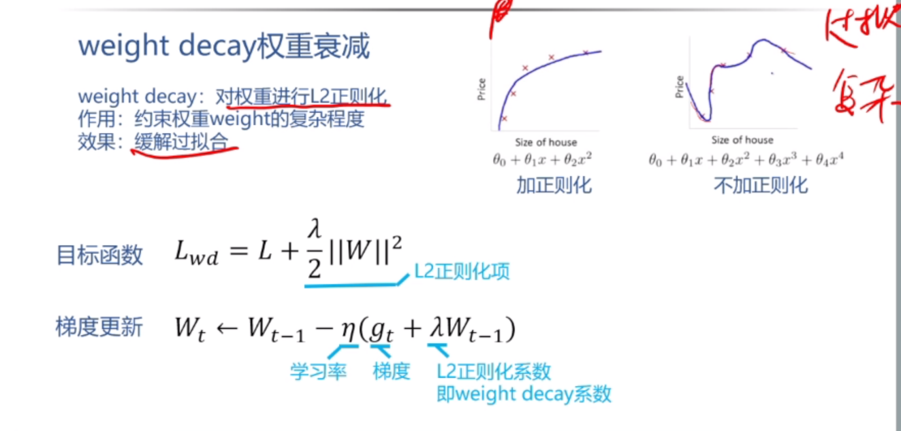

${toc}

## 论文要点
### AlexNet

**问题** 

- $Q$: AlexNet 中使用了什么激活函数？ ReLU 相比 Sigmoid 的主要优势有哪些？
    > $A$: ReLU。优点：1. 硬件友好，计算速度快。2.不会发生饱和，可以缓解梯度消失的情况

- $Q$: Dropout 为什么可以减少过拟合？Dropout 是怎么计算的？ 
    > $A$: 使用 Dropout 的话，相当于训练了很多个神经网络，这些网络共享参数
    > 每一个网络过拟合的地方不同，测试时，对这些网络取平均，过拟合相互抵销。

- $Q$: AlexNet 的结构是怎么样的，几个卷积层，几个全连接层 
    > $A$:  5个卷积层，3个全连接层

- $Q$: AlexNet 使用了哪些减少过拟合的方法
    > $A$: 数据扩增 和 Dropout。 

- $Q$: AlextNet 的数据扩增是怎么做的 
    > $A$: 数据扩增有两种
    > 1. 平移和水平反转，实际上就是将图片的主体移动到中心位置
    > 2. 改变 RGB 的值。利用 pca 获取主成分，然后在特征值上乘上高斯随机数

- $Q$: AlexNet 的网络结构中，有什么不合理的地方吗？ 
    > $A$:  第一个层的卷积核过大，这导致计算量会很大

- $Q$: AlexNet 有什么后面人们不再使用的结构吗？  
    > $A$:  LRN

### VGG

**背景介绍** 

2014 年 ImageNet 比赛第二名

**提升方式** 

增加卷积层个数，增加网络深度。

**成果** 

- 在 ImageNet 比赛中取得良好成绩
- 泛化效果好

**问题** 

- $Q$: VGG的网络结构有什么特点？卷积层和maxpool层是按什么规律排布的?  
    > $A$: 特点:网络层次很深, 由五个卷积块和三个全连接层构成; 每一个卷积块由若干个卷积层构成，每一个卷积层的卷积核大小都是3*3, padding=1。卷积块之间有池化层，kernel_size = 2, 步长为2。 规律：一个卷积块后跟上一个 maxpool 层。

- $Q$: 如何理解 VGG 中的卷积块？多个 3*3 为什么可以替代一个大卷积核？代替后有哪些好处？
    > $A$: 一个卷积快由若干个卷积层构成，每一个卷积层后都有一个 relu层。因为施用多个3*3的卷积核的效果和大卷积核的感受野是一样的。好处：(1) 参数个数减少，计算量下降，可以减少过拟合。(2) 卷积层之间有 relu，增加非线性操作，提升鉴别能力

- $Q$: VGG 是否使用了 LRN, 为什么 
    > $A$: 没有，因为 使用 LRN 不能提高模型的正确率，徒增计算量

- $Q$: 什么是感受野？ 
    > $A$: 输出特征图的像素点在输入特征图上映射的区域 （神经网络中，一个神经元看到的区域）

- $Q$: 训练中使用动量，会对梯度有什么影响？使用动量有什么好处？ 
    > $A$: 对每次迭代计算的梯度做加权平均，使用动量的好处是能够抵消梯度的抖动，加快算法收敛的速度。

- $Q$: weight decay 对目标函数有什么影响？使用 weight decay 有什么好处？ 
    > $A$: 约束权重 weight 过拟合，缓解过拟合

- $Q$: VGG 是如何初始化的 
    > $A$: 先用最浅的神经网络 A 来训练，训练更深层次的网络时，就将 A 模型训练得到的参数作为深层网络的初始参数。后面作者发现使用 Xavier/Kaiming 的初始化方式也行。

- $Q$: 如何理解 Xavier 和 Kaiming 的初始化思路？ 
    > $A$:  为了防止出现 **梯度消失** 和 **梯度爆炸**, 合理的初始化应该保证 **输入和输出的分布相同** 

- $Q$: VGG 在训练和测试时都使用了多尺度图像扩增，有什么效果 
    > $A$:  多尺度的效果会比单尺度好 (256-512) 随机选取图像

    
- $Q$: VGG 还尝试了多个模型融合，有什么效果
    > $A$:  多模型融合的效果会更好

- $Q$: 为什么 VGG 最深为19层 
    > $A$:  因为到了19层，模型基本已经饱和了，再增加层数模型的准确率不会再有所变化。

### GoogLeNet

**背景** 
2014 年 分类冠军

- $Q$: GoogLeNet 的总体设计目标是什么？
    > $A$: 1. 提升深度神经网络的深度和宽度。 2. 不增加 (减少) 计算量。

- $Q$: 直接去掉网络中较大权重的稀疏方法有什么缺陷
    > $A$: 1. 网络损失：直接剪枝可能会导致网络的性能下降，因为剪枝会删除某些权重，从而丢失一部分网络所学到的知识。 
    > $A$: 2. 不规则性：直接剪枝可能会导致网络中的稀疏性变得不规则。 
    > $A$: 3. 训练代价：直接剪枝可能需要进行多轮的迭代训练和剪枝过程，以找到要删除的权重。

- $Q$: 从设计思路讲，Inception 是如何实现稀疏的 
    > $A$: 通过使用 1*1 的卷积层，这是因为 1\*1 的网络结构可做到数据降维，使得网络学习到主要信息，忽略次要信息。

- $Q$: 如何将赫布理论 (fire togethe, wire together) 运用到 Inception 的设计中
    > $A$: 通过使用 1\*1 卷积，将神经元聚合在一起

- $Q$: Inception 的结构大概是什么样的？有几个分支，分别是什么。 
    > $A$: 由输入分成四个分支，分别进行不同的卷积运算，最后汇总到输出层。 
    > 有四个分支，第一个分支是 1\*1， 第二个分支 1\*1 和 3\*3， 第三个分支 1\*1 和 5\*5, 第四个分支 max-pool 和 1\*1

- $Q$: Inception 中 1\*1 的卷积作用是什么?
    > $A$: 1. 用于数据降维，减少训练参数，减少数据量。2. 增加非线性， 防止过拟合

- $Q$: GoogleNet 中添加辅助 loss 的目的是什么？ 测试的时候是否还需要辅助 loss。  
    > $A$: GoogLeNet 网络层次太深，在反相传播的过程中可能会发生梯度消失。测试的时候不需要。

**拓展** 

神经网络减枝
patch:

### ResNet

2015 年 ImageNet 冠军

2016 年 best paper

- $Q$: 什么是退化问题 ?
    > $A$: 使用过深的网络结构训练模型，训练误差和测试误差反而会增加。

- $Q$: 什么实验现象表明是退化问题而不是过拟合问题 ?
    > $A$: 因为 在退化问题中，训练误差和测试误差都增加。如果是过拟合问题，应该是测试误差增加
    >    训练误差减少。

- $Q$: 如何理解残差连接，为什么残差连接可以解决退化问题?
    > $A$: 因为残差连接是用 非线性层来 拟合 残差函数，比起直接用来拟合最优函数效果
    > 要好的多。

- $Q$: 在网络结构上如何实现残差连接？（分维度不变和维度改变两种情况） 
    > $A$: 维度不变，之间将之前层的输出按元素加入当前层的输出。
    >   维度改变，之间将之前层的输出经过投影矩阵后，按元素加入当前层的输出。

- $Q$: 从参数和计算量上，残差连接有什么优势？ 
    > $A$: 残差连接不会增加参数, 计算量很小

- $Q$: bottleneck 结构是怎样的？ 其中 1\*1 卷积的作用是什么? 为什么要设计bottleneck结构?
    > $A$：bottleneck 有三个卷积层构成，分别为 1\*1, 3\*3, 1\*1, 第一个 1\*1是为了降维，减少 3\*3
    > 的计算量，第二个 1\*1为了升维。使用 bottleneck 结构可以减少计算量，加快训练速度。 

- $Q$: BN 和 conv relu 的关系是什么 ?
    > $A$: bn 层在 conv 和 relu 之间

- $Q$: BN 是为了解决什么问题，为什么可以解决这个问题 ?
    > $A$: BN 是为了解决 内部协变量偏移，bn 的做法是将中间层参数按照均值为0，标准差为1的高斯分布标准化。
    > BN 能够解决这个问题的原因是：(同时也保证不会发生梯度消失的问题)

- $Q$: 训练和测试时，BN的计算过程分别是怎么样的？ 
    > $A$: 训练时: 计算一个 batch 的均值和标准差，做归一化，然后进行
    > scale and shift, 同时学习 scale 和 shift 的参数 
    > 测试时，用训练时得到的均值和方差标准法，并进行 scale 和 shift

- $Q$: 有哪些训练和测试时，计算方式不同的层 ?
    > $A$: BN 层。在训练过程中，Batch Normalization会根据每个批次的数据进行归一化处理，并且维护每个批次的均值和方差。但是在测试过程中，由于无法得知整个测试集的统计信息，所以需要使用训练阶段积累的移动平均均值和移动平均方差来进行归一化。

- $Q$: 加入 BN 后，网络结构和训练超参数需要做出哪些调整 ?
    > $A$: 1.在卷积层和relu层之前，需要加入 bn 层
    > 2. 调整批大小 

- $Q$: 为什么不能同时使用 bn 和 dropout 
    > $A$:  1. 冲突的噪声引入：BN层对输入数据进行归一化，有一定的正则化效果，而Dropout层在训练过程中随机丢弃神经元，引入了另一种噪声。同时使用它们可能会引入冲突的噪声信号，可能会干扰模型的学习过程。

    >   2.减弱BN的优势：BN层在训练过程中通过对每个批次的归一化来加速模型的训练，并且提供了一定的正则化效果。而Dropout层的引入可能会削弱BN层的正则化效果，使得模型的训练过程不再那么稳定和高效。

**展望** 

很大一部分工作都在使用 ResNet 做 backbone (骨干)

### transformer 模型

- $Q$: 1.Transformer为何使用多头注意力机制？（为什么不使用一个头）
    > $A$: 为了能学到不同模式下的信息，达到类似卷积多通道的效果
    
- $Q$: 2.Transformer为什么Q和K使用不同的权重矩阵生成，为何不能使用同一个值进行自身的点乘？ （注意和第一个问题的区别）
    > $A$: - 使用 Q 点乘 K 本质上是求出一个 attention score 矩阵， 这个矩阵存储了一个句子中每一个词与其他
    > 词的距离大小。如果是 K * K，因为是同样一个矩阵，都投影到了同样一个空间，所以泛化能力很差。
    >  - 使用不同权重矩阵可以保证在不同空间内进行投影，提升表达能力，增加了泛化能力。

- $Q$: 3.Transformer计算attention的时候为何选择点乘而不是加法？两者计算复杂度和效果上有什么区别？
    > $A$: 两者效果差不多,  但是矩阵乘法更好并行，对于硬件更加友好。

- $Q$: 4.为什么在进行softmax之前需要对attention进行scaled（为什么除以dk的平方根），并使用公式推导进行讲解
    > $A$: 由于 $d_k$ 的值很大，进行矩阵相乘后，结果会很大，而 $\text{ softmax}$ 函数会将结果很大的
    > 数据点推向曲线的两端 (梯度很小的位置)，不利于进行梯度的反向传播

- $Q$: 5.在计算attention score的时候如何对padding做mask操作？
    > $A$: 将当前时间后的数值替换为 一个绝对值较大的负数，这样经过 $\text{ softmax}$函数后，对应值会变成0 

- $Q$: 6.为什么在进行多头注意力的时候需要对每个head进行降维？（可以参考上面一个问题）
    > $A$: 将原有的高度降成低维度再进行拼接，可以丰富特征信息。

- $Q$: 7.大概讲一下Transformer的Encoder模块？
    > $A$: encoder 模块由6个完全相同的层构成，每一层有两个子层。
    > 第一个子层是 multi-head attention machanism, 第二层是 mlp (两个线性层)

- $Q$: 8.为何在获取输入词向量之后需要对矩阵乘以embedding size的开方？意义是什么？
    > $A$: embedding matrix的初始化方式是xavier init，这种方式的方差是1/embedding size，因此乘以embedding size的开方使得embedding matrix的方差是1，在这个scale下可能更有利于embedding matrix的收敛。

- $Q$: 9.简单介绍一下Transformer的位置编码？有什么意义和优缺点？
    > $A$: 根据 单词所在句子中的位置，生成一个 512 位的位置编码，再与单词的向量进行相加
    >   优点，为 单词添加了位置信息。

- $Q$: 10.你还了解哪些关于位置编码的技术，各自的优缺点是什么？
    > $A$: RPE, 和 复数函数域

- $Q$: 11.简单讲一下Transformer中的残差结构以及意义。
    > $A$: 可以解决 网络结构层过多而造成的梯度消失问题 

- $Q$: 12.为什么transformer块使用LayerNorm而不是BatchNorm？LayerNorm 在Transformer的位置是哪里？
    > $A$: LayerNorm 是一个样本(句子)进行标准化，而 BatchNorm 是对一个 batch 进行标准化。
    > 由于在 nlp 中, 句子的长短不同，这就导致不同batch的长度不同(补0对齐)，使用 bn 的效果不好
    > encoder 和 decoder 每一个子层的输出

- $Q$: 13.简答讲一下BatchNorm技术，以及它的优缺点。
    > $A$: 见 resnet
        
- $Q$: 14.简单描述一下Transformer中的前馈神经网络？使用了什么激活函数？相关优缺点？
    > $A$: relu

- $Q$: 15.Encoder端和Decoder端是如何进行交互的？（在这里可以问一下关于seq2seq的attention知识）
    > $A$: encoder 端的输出作为 decoder 第二个子层 key, value 的输入。

- $Q$: 16.Decoder阶段的多头自注意力和encoder的多头自注意力有什么区别？（为什么需要decoder自注意力需要进行 sequence mask)
    > $A$: 为了保证不提前看到 t 时刻后的 token

- $Q$: 17.Transformer的并行化提现在哪个地方？Decoder端可以做并行化吗？
    > $A$: Encoder侧：模块之间是串行的，一个模块计算的结果做为下一个模块的输入，互相之前有依赖关系。从每个模块的角度来说，注意力层和前馈神经层这两个子模块单独来看都是可以并行的，不同单词之间是没有依赖关系的。
    > Decode引入sequence mask就是为了并行化训练，Decoder推理过程没有并行，只能一个一个的解码，很类似于RNN，这个时刻的输入依赖于上一个时刻的输出。

- $Q$: 19.Transformer练的时候学习率是如何设定的？Dropout是如何设定的，位置在哪里？Dropout 在测试的需要有什么需要注意的吗？
    > $A$: 每一个子层输出时，都进行 dropout （早于 norm）， $P_{drop} = 0.1$ 

[answear](https://zhuanlan.zhihu.com/p/496012402?utm_medium=social&utm_oi=629375409599549440) 

